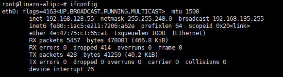
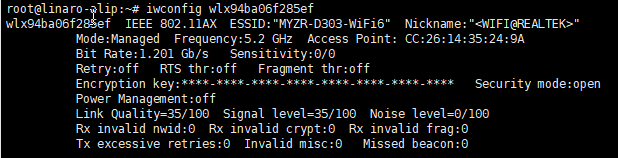

SDK环境搭建

Software Development Kit

软件开发工具包

给芯片专用的编译+配置+编译工具+驱动+系统

装编译需要的基础工具（安装依赖库）

解压SDK包（类似于SS528v100_SDK.tar.gz）

安装交叉编译工具链（在电脑上编译，板子上运行）


# 打印日志

临时关闭内核所有打印

dmesg -n 1

临时降低控制台内核日志输出，只显示错误及更高级别信息

echo 3 > /proc/sys/kernel/printk

其他常用级别推荐

调试驱动 / 内核：`echo 7 > /proc/sys/kernel/printk`（输出所有日志）

恢复默认：`echo 4 > /proc/sys/kernel/printk`


# 文件命令

查找文件

```
find / -name "serial_test.out" 2>/dev/null
```


查找包含“wifi”关键词的文件和脚本

```
find / -name "*wifi*" 2>/dev/null
```

**`mv`**：Linux 系统的**移动 / 重命名命令**（重命名本质就是原地移动）

```
mv serial_test\(1\).c serial_test.c
```

等价简化写法（更易读）

用**引号包裹文件名**，就不需要手动加转义符了，推荐使用：

```
mv "serial_test(1).c" serial_test.c
```

给蓝牙模块（瑞昱 RTL8852BU）装固件（驱动文件）

mkdir     -p      /lib/firmware/rtl_bt/
cp             /lib/firmware/rtl8852bu_fw                       /lib/firmware/rtl_bt/rtl8852bu_fw.bin
cp               /lib/firmware/rtl8852bu_config /lib/firmware/rtl_bt/rtl8852bu_config.bin

**-p** = 没有就创建，有就不报错

把 `rtl8852bu_fw` 这个蓝牙固件，复制到 `/lib/firmware/rtl_bt/` 目录下，并重命名成 `rtl8852bu_fw.bin`。

把蓝牙配置文件 `rtl8852bu_config` 也复制过去，并重命名成 `rtl8852bu_config.bin`。

创建蓝牙文件夹 → 复制蓝牙固件 → 复制蓝牙配置

# history 命令用法

查看当前终端执行过的所有历史命令。

# 网口

## 网口登录

### 使用命令

使用串口查看IP，再使用网口登录开发板

查看网卡名称ifconfig或者ip addr

自动获取IP（临时命令，重启失效）

```
#释放原有的IP
dhclient -r
#从路由器DHCP自动获取IP
dhclient eth0
```

dhclient:专门向路由器申请IP的工具

-r  release（释放）主动放弃当前IP地址


### cmd查看网线IP网段

**例**：IPv4 地址：192.168.131.186
子网掩码：255.255.248.0
默认网关：192.168.128.1

子网掩码对应的网段计算：

248→1111 1000，即为/21网段（8+8+5，CIDR法，1代表网段号，0代表主机号），网段步长为8（256-248=8，每个网段的第三段都会以8为单位递增）

131➗️8=16........3→说明131落在128~135这个网段里

**结论**：设备IP在192.168.**128**.0 ~ 192.168.**135.255** 之间都能正常连接

## 网口测试

测试说明：采用开发板向PC发送ICMP报文的方式进行测试。

测试操作：

1.配置电脑有线网卡为192.168.137.99

2.使用网线连接开 发板网口和电脑网口。

3.配置开发板静态IP

```Plain
ifconfig eth0 up
ifconfig eth0 192.168.137.81
```

4.输入指令验证网口0

```Plain
ping -I eth0 192.168.137.99 -c 2 -w 4
ping -I wlan0 www.baidu.com
```

**注意事项：**

```
ifconfig eth1
输出
eth1      Link encap:Ethernet  HWaddr 0A:2A:89:51:70:CF  
          inet addr:192.168.137.81  Bcast:192.168.137.255  Mask:255.255.255.0
          inet6 addr: fe80::82a:89ff:fe51:70cf/64 Scope:Link
          UP BROADCAST RUNNING MULTICAST  MTU:1500  Metric:1     //RUNNING→判断物理层是否连接成功
          RX packets:264 errors:0 dropped:17 overruns:0 frame:0
          TX packets:12 errors:0 dropped:0 overruns:0 carrier:0
          collisions:0 txqueuelen:1000 
          RX bytes:22326 (21.8 KiB)  TX bytes:996 (996.0 B)
          Interrupt:129 Base address:0x8000 
```




`inet 192.168.128.55` 是我们日常最常用的 **IPv4 地址**

`inet6 fe80::1ac5:e211:7206:a62e` 是 IPv6 链路本地地址，是网卡自动生成的用于局域网通信的地址

子网掩码为255.255.248.0

主机和板子要ping通必须要在同一个子网掩码下

公司IPv4地址192.168.131.186	子网掩码255.255.248.0（短网线）

==自动获取ip==

- dhclient

```
sudo dhclient
```

**DHCP**：Dynamic Host Configuration Protocol，动态主机配置协议

**Client**：客户端

- udhcpc

获取网口1 IP地址

```
udhcpc -i eth1
#输出
root@myzr-t536-buildroot:~$ udhcpc -i eth0 
udhcpc: started, v1.35.0
udhcpc: broadcasting discover
udhcpc: broadcasting select for 192.168.128.111, server 192.168.128.1
udhcpc: lease of 192.168.128.111 obtained from 192.168.128.1, lease time 300
deleting routers
adding dns 192.168.128.1
```

成功从 DHCP 服务器 `192.168.128.1` 拿到 IP：`192.168.128.111`


UDP DHCP Client

-i  interface (网络接口)

# WiFi

## WiFi连接

```
#查看WiFi连接状态
iwconfig wlan0
关闭wifi
ifconfig wlan0 down
#断开连接
sudo nmcli connection down wlan0
```

> iw：wireless tool

nmcli：Linux 系统自带的网络管理工具

**解决连接不成功问题**

```
#强制扫描所有 WiFi 信号
nmcli device wifi rescan
#列出所有能搜到的 WiFi
nmcli device wifi list
#杀掉进程
killall wpa_supplicant
```

```python
killall wpa_supplicant dhclient
#删除IPv4 地址、子网配置，网卡恢复无 IP 空白状态
ip addr flush dev wlan0
#重启，重新扫描 WiFi、自动连接已保存热点并重新获取 IP
systemctl restart NetworkManager
nmcli dev wifi connect "MYZR-WiFi5" password "Myzr2012"
```

- 法2

```python
#生成WiFi密码的加密配置，写入配置文件
wpa_passphrase LZJ 88888888 > /etc/wpa_supplicant.conf
wpa_passphrase MYZR-WiFi5 Myzr2012 > /etc/wpa_supplicant.conf
#启动WiFi连接
wpa_supplicant -B -i wlan0 -c /etc/wpa_supplicant.conf
#向路由器请求分配IP地址
dhclient -v wlan0
#或者
udhcpc -i wlan0
#测试联网
ping -I wlan0 8.8.8.8
#断开当前 WiFi

```

-B：Background，后台运行 

-v ：verbose，详细日志输出

ISC DHCP Client（ISC 官方 DHCP 客户端）

DHCP（Dynamic Host Configuration Protocol，动态主机配置协议

`8.8.8.8`：Google 的公共 DNS 服务器，是常用的公网连通性测试地址

**U**nix **D**HCP **C**lient（BusyBox 内置轻量 DHCP 客户端）

```python
#获取IP
udhcpc -i wlan0
#测试连接
ping -I wlan0 www.baidu.com -c 2 -w 4
```

-i ：interface，指定网卡接口

-c 2：只发送2个数据包

-w 4：全局超时4秒

## 更改WiFi名字

```py
#查看主机网络名
hostname
#永久修改主机名
sudo hostnamectl set-hostname wlan0
#编辑host文件同步配置
sudo nano /etc/hosts
#找到类似行编辑
127.1.1.1 旧主机名
```

## WiFi性能测试


输出



Link Quality=35/100   	signal level=35/100

信号质量:35%					信号强度：35% 丢包原因

**安装WiFi性能测试工具**

开发板安装iperf3

```Plain
apt update
apt install iperf3 -y
```

**测试参数**

Interval 测试时间区间  0~30秒测试 每秒输出一次统计

Transfer 区间传输总数据量 单位MByte(兆字节)

Bitrate 区间内的平均传输速率  ==核心指标== 单位Mbits/sec(兆比特/秒)

Retr Retransits(重传次数) TCP传输中，丢包/超时，导致的重发的数据包数量

sender/receiver 发送端/接收端统计 对比两端数据是否一致，判断链路丢包情况✅️

usr (User CPU time)  CPU花在用户态（应用程序）上的时间占比

sys (System CPU time) CPU花在内核态（系统调用、内核处理）上的时间占比

idle（idle time）CPU空闲时间占比

sirq (soft IRQ time) CPU花在软中断处理上的时间占比

lose packet 丢包率

**具体步骤**

将电脑端和开发板连接在同一路由器下

电脑安装iperf3  :https://iperf.fr/download/windows/iperf-3.1.3-win64.zip

运行服务端（cmd）命令

```Plain
iperf3 -s -i 1
```

-s  启动服务端模式（被动等待客户端连接）

-i   1   设置打印时间间隔为1秒表格

| 角色                | 命令                   | 作用                   | 网络行为                 |
| ------------------- | ---------------------- | ---------------------- | ------------------------ |
| **服务端 (Server)** | `iperf3 -s`            | 被动等待连接，接收数据 | 监听端口，不主动发起连接 |
| **客户端 (Client)** | `iperf3 -c <服务器IP>` | 主动发起连接，发送数据 | 主动向服务器发起连接     |

`-R` 不会改变「谁是客户端、谁是服务端」，只会改变「**数据的传输方向**」：

不加 `-R`：客户端发，服务端收

加 `-R`：客户端收，服务端发

所以电脑运行 `iperf3 -s` 永远是服务端，开发板运行 `iperf3 -c` 永远是客户端， `-R` 只是让服务端主动往客户端发数据而已。

运行WiFi性能测试命令(64KB包长)

```Plain
iperf3 -c 192.168.243.237 -i 1 -t 30 -l 65507
```

-c 192.168.243.237（电脑IP）以客户端连接电脑（服务端）


输（发送性能）

```Bash
- - - - - - - - - - - - - - - - - - - - - - - - -
[ ID] Interval           Transfer     Bitrate         Retr
[  5]   0.00-30.00  sec  72.8 MBytes  20.4 Mbits/sec    7             sender
[  5]   0.00-30.00  sec  72.4 MBytes  20.2 Mbits/sec                  receiver

iperf Done.
```


发大包64KB：sys会偏高，因为大包在内核里，拷贝的开销更大

发小包（1.5KB/32KB）：sirq相对稳定或略高，sys反而更低，因为每个包都要触发一次中断，包越多中断越频繁，但每个包的内核处理逻辑更轻量。

接收性能（Rx：电脑 → 开发板）


​	**丢包率,使用UDP**

开发板→电脑

```
iperf3 -c 192.168.1.223 -u -b 10M -t 10 --length 1472 | awk '/sender/ {print "速率: "$7" "$8," 丢包率: "$12}'
```

电脑→开发板

```
iperf3 -c 192.168.1.223 -u -b 30M -t 10 -R --length 1472 | awk '/sender/ {print "速率: " $7 " " $8, " 丢包率: " $12}'
```

-u 	使用UDP协议 	-b	发送带宽（bandwidth）限制为10Mbps

awk 	 文本处理工具，用于截取字段

HDMI

外接显示器、电视、投影仪，长距离传高清音视频，通用外设接口。


# MIPI

主板直连液晶屏、摄像头，板内短距离高速传输，嵌入式设备标配。

```python
#查看是否检测到 video 设备
v4l2-ctl --list-devices
#输入指令，开启摄像头。
gst-launch-1.0 v4l2src device=/dev/video23 ! 'video/x-raw,format=NV12,width=800,height=1280,framerate=30/1' ! autovideosink
```

gst-launch-1.0:GStreamer 是 Linux 最常用的**视频流工具**

专门用来开摄像头、推流、显示、编码

video/x-raw,format=NV12,width=800,height=1280,framerate=30/1

格式：NV12（嵌入式摄像头最常用）

宽度：800

高度：1280

帧率：30 帧

autovideosink:自动找屏幕显示画面,HDMI 屏、MIPI 屏都能自动显示

# 485测试

将serial_test.c文件传到xsehll，编译生成可执行文件

```Plain
gcc serial_test.c -o serial_test.out
```

使用485-USB转换头连接开发板和电脑，使用Xshell打开对应串口,将波特率设置成115200，数据为8位，停止位1位

```Plain
./serial_test.out /dev/ttyS0 "Hello RS485" 
```

数据收发内容完全一致，无乱码或丢包


# UART应用

（要新开串口终端）

短接UART7的RX、TX，在板卡上运行发送命令

```Python
./serial_test.out /dev/ttyS7 "myzr"
```

输出

```Plain
Starting send data...finish
Starting receive data:
ASCII: 0x6d          Character: m 
ASCII: 0x79          Character: y 
ASCII: 0x7a          Character: z 
ASCII: 0x72          Character: r 
ASCII: 0x0          Character:  
```


## 4G测试

【测试说明】：4G连接成功后，开发板向外网发送ICMP报文来验证连接正常

【接口标识】：U38

【系统设备】：/dev/ttyUSB1，usb0

【测试操作】：

1. 把4G天线连接到”U3”接口上，把SIM卡插到“J3”卡槽
2. 对4G_PWRKEY1引脚设置高电平来开机4G，输入命令如下：

```
echo 98 > /sys/class/gpio/export
echo out > /sys/class/gpio/gpio98/direction
echo 1 > /sys/class/gpio/gpio98/value
echo 64 > /sys/class/gpio/export
echo out > /sys/class/gpio/gpio64/direction
echo 1 > /sys/class/gpio/gpio64/value
```

1. 输入以下指令，适配启动4G

```
echo -e "AT+QNETDEVCTL=3,1,1\r\n" > /dev/ttyUSB1
```

1. 输入以下指令，查看4G是否启动成功

```
lsusb
```

输出信息如下，出现Quectel EC801E-CN表示成功，如果没有需等待1分钟：

```
Bus 001 Device 001: ID 1d6b:0002 Linux 6.1.111-rt42 ehci_hcd EHCI Host Controller
Bus 001 Device 003: ID 0bda:d723 Realtek 802.11n WLAN Adapter
Bus 001 Device 002: ID 1a40:0101 USB 2.0 Hub
Bus 001 Device 005: ID 2c7c:0903 Quectel EC801E-CN
```

1. 输入以下指令，获取IP

```
udhcpc -i usb0
```

输出信息如下：

```
udhcpc: started, v1.37.0
udhcpc: broadcasting discover
udhcpc: broadcasting select for 192.168.43.100, server 192.168.43.1
udhcpc: lease of 192.168.43.100 obtained from 192.168.43.1, lease time 86400
deleting routers
adding dns 192.168.43.2
adding dns 192.168.43.3
```

1. 输入以下指令，进行4G验证：

```
ping -I usb0 www.baidu.com -c 3
```

输出信息如下：“0% packet loss”表示测试通过

```
PING www.baidu.com (183.240.99.224): 56 data bytes
64 bytes from 183.240.99.224: seq=0 ttl=51 time=56.363 ms
64 bytes from 183.240.99.224: seq=1 ttl=51 time=56.105 ms
64 bytes from 183.240.99.224: seq=2 ttl=51 time=55.599 ms

--- www.baidu.com ping statistics ---
3 packets transmitted, 3 packets received, 0% packet loss
round-trip min/avg/max = 55.599/56.022/56.363 ms
```

# 蓝牙测试

识别蓝牙

```python
启动蓝牙，输入指令如下：
hciconfig hci0 up
扫描外部蓝牙设备，输入指令如下：
hcitool scan
输出：
[  679.593805] rtk_btcoex: inquiry complete
        D0:57:7E:BF:9B:44        SZ-L0648
        10:38:1F:5C:61:9D        n/a
        7C:21:4A:C7:A2:21        PFBYRXUIAKYSFRJ
        74:B5:87:DB:09:7A        chensz
获取输出信息，需要的信息类似如下” 74:B5:87:DB:09:7A chensz”
发送L2CAP包测试，输入指令如下：
l2ping 74:B5:87:DB:09:7A
输出信息：
root@root:/# l2ping 74:B5:87:DB:09:7A
Ping: 74:B5:87:DB:09:7A from C8:FE:0F:02:26:03 (data size 44) ...
0 bytes from 74:B5:87:DB:09:7A id 0 time 7.54ms
0 bytes from 74:B5:87:DB:09:7A id 1 time 14.19ms
0 bytes from 74:B5:87:DB:09:7A id 2 time 142.73ms
0 bytes from 74:B5:87:DB:09:7A id 3 time 111.30ms
0 bytes from 74:B5:87:DB:09:7A id 4 time 131.44ms
^C5 sent, 5 received, 0% loss
结果：”0% packet loss”表示蓝牙连接正常
```


# RTC时钟

`hwclock` 默认输出的是 RTC 硬件时钟的原始值，格式是 `YYYY-MM-DD HH:MM:SS.ffffff+00:00`，这是标准的 ISO 8601 格式。

+00:00 表示 RTC 时钟存储的是 UTC 时间，和系统时区无关。

设置（set）系统时间

```Plain
date -s "2026-4-30 18:18:30"
```

将系统时间写入硬件RTC

```Plain
hwclock -w
#或者hwclock -w -f /dev/rtc0（-f→file）
```


# 摄像头模块测试

#第一个! \：!是 gstreamer 管道分隔符，\换行
#第二个! \：编码参数结尾! + 续行换行

```
#3576 3个摄像头
gst-launch-1.0 v4l2src device=/dev/video51 ! \
'video/x-raw, format=NV12, width=800, height=1280, framerate=30/1' ! \
queue ! videoconvert ! queue ! autovideosink sync=false

gst-launch-1.0 v4l2src device=/dev/video33 ! \
'video/x-raw, format=NV12, width=800, height=1280, framerate=30/1' ! \
queue ! videoconvert ! queue ! autovideosink sync=false

gst-launch-1.0 v4l2src device=/dev/video42 ! \
'video/x-raw, format=NV12, width=800, height=1280, framerate=30/1' ! \
queue ! videoconvert ! queue ! autovideosink sync=false
```


```
gst-launch-1.0 v4l2src device=/dev/video11 ! 'video/x-raw,format=NV12,width=800,height=1280,framerate=30/1' ! autovideosink
```

打开摄像头/dev/video 11,设置分辨率800×1280，格式NV12,30帧，实时预览画面

**gst-launch-1.0 Gstreamer** 视频框架工具 打开摄像头、推流、预览、编码、测试视频

**v4I2src** 视频源：Linux摄像头标准驱动接口，V4L2 摄像头采集源插件，从 CSI/USB 摄像头读取原始图像数据

**device=/dev/video11** 指定摄像头设备节点

**！** 管道符号 数据往下传

**format=NV12** 视频数据格式

**framerate=30/1**  30帧每秒

**autovideosink** 自动显示画面 自动找屏幕、显示器、HDMI输出

**USB摄像头测试**

验证USB摄像头是否能被系统识别，支持的格式参数，画面能否正常采集并显示在显示屏上

```
#完整列出所有视频设备
v4l2-ctl --list-devices
#输出 video33/42/5  物理摄像头看mainpath
rkisp-statistics (platform: rkisp):
	/dev/video39
	/dev/video40
	/dev/video48
	/dev/video49
	/dev/video57
	/dev/video58

rkcif (platform:rkcif-mipi-lvds):
	/dev/video0
	/dev/video1
	/dev/video2
	/dev/video3
	/dev/video4
	/dev/video5
	/dev/video6
	/dev/video7
	/dev/video8
	/dev/video9
	/dev/video10
	/dev/media0

rkcif-mipi-lvds1 (platform:rkcif-mipi-lvds1):
	/dev/media1

rkcif-mipi-lvds3 (platform:rkcif-mipi-lvds3):
	/dev/media2
#每个 mainpath 第一个节点（video33/42/51）是主预览口
rkisp_mainpath (platform:rkisp-vir0):
	/dev/video33
	/dev/video34
	/dev/video35
	/dev/video36
	/dev/video37
	/dev/video38
	/dev/video41
	/dev/media3

rkisp_mainpath (platform:rkisp-vir1):
	/dev/video42
	/dev/video43
	/dev/video44
	/dev/video45
	/dev/video46
	/dev/video47
	/dev/video50
	/dev/media4

rkisp_mainpath (platform:rkisp-vir2):
	/dev/video51
	/dev/video52
	/dev/video53
	/dev/video54
	/dev/video55
	/dev/video56
	/dev/video59
	/dev/media5

rkvpss_scale0 (platform:rkvpss-vir0):
	/dev/video61
	/dev/video62
	/dev/video63
	/dev/video64
	/dev/media6

rkvpss_scale0 (platform:rkvpss-vir1):
	/dev/video65
	/dev/video66
	/dev/video67
	/dev/video68
	/dev/media7

rkvpss_scale0 (platform:rkvpss-vir2):
	/dev/video69
	/dev/video70
	/dev/video71
	/dev/video72
	/dev/media8

```

**同源分流，一源多路输出**

- `/dev/video33`：**全尺寸主路（预览专用）**，完整原始分辨率 NV12，gst 预览用的画面
- `video34~38、video41`：**同源复制的分支通道**，ISP 硬件实时裁切 / 缩小画面，**独立输出小分辨率图像**，互不依赖主路 33

**节点选用**

- mainpath 首设备为全分辨率捕获口，原生匹配 sensor 尺寸。输出**Sensor 出厂完整物理分辨率**（比如800×1280），和摄像头感光芯片实际像素一一对应，无裁切、无缩放，画面像素完整，最适合屏幕实时预览。
- 同组`video34~38/video41`出厂默认被 ISP 硬件**提前裁剪降分辨率**，尺寸比原生小，直接预览画面会被裁切、缺画面区域。

若用 ffmpeg 编码录像，可以选用同组靠后的小分辨率节点，节省带宽。


列出系统中所有V4L2设备（video4Linux4,Linux标准视频设备框架）

```
v4l2-ctl --list-formats-ext -d /dev/video21
```


查看摄像头支持的格式（如JPEG、YUYV、NV12等）

```
v4l2-ctl -V -d /dev/video21
```

采集格式查询。视频格式参数，包括分辨率、格式、帧率等

```
gst-launch-1.0 v4l2src device=/dev/video21 \
! 'image/jpeg,width=1920,height=1080,framerate=30/1' \
! jpegdec \
! videoconvert \
! autovideosink
```

播放画面指令

jpegdec:JPEG格式解码，将压缩的JPEG数据转为原始数据帧

videoconvert ：视频格式转换，适配显示设备的格式要求


# 5G测试

```
./app/03_4g/quectel-CM &
ping -I rmnet_usb0.1 www.baidu.com -c 3
```


启动4G模块拨号上网 再用rmnet_usb0.1 网卡ping百度测试网络通不通


./app/03_4g 工具当前路径

quectel-CM:移远4G模块拨号工具

& 后台运行，不占用终端


-I rmnet_usb0.1 :指定从4G网卡出口

-c 3  只发三个包

用4G网卡ping3次百度，验证4G是否能上网


# watchdog测试

如果程序死机，忘记定期喂狗，它会强制重启设备，防止系统卡死

```
/test_app/wdt_driver_test.out 4 2 1 &
```

正常喂狗，验证不死机逻辑

4  看门狗超时时间设置为4秒

2  应用程序的喂狗间隔为2秒

1  测试模式（代表正常喂狗模式）

```
/test_app/wdt_driver_test.out 10 15 
```

不喂狗，验证死机重启逻辑


应用程序的喂狗时间间隔（15秒）超过了超时时间（10秒）

看门狗触发系统自动重启，则代表看门狗超时自动复位正常

```
echo 8 > /sys/class/gpio/export
echo out > /sys/class/gpio/gpio8/direction
while true; do echo 1 > /sys/class/gpio/gpio8/value;sleep 1;echo 0 > /sys/class/gpio/gpio8/value;sleep 1; done
```

内核开放 gpio8 控制接口，生成 `/sys/class/gpio/gpio8` 目录。

export为特殊可写虚拟文件

将引脚配置为输出，可手动控制高低电平。

无限循环周期性输出脉冲喂狗（核心喂狗逻辑）

```
while true; do
    echo 1 > /sys/class/gpio/gpio8/value
    sleep 1
    echo 0 > /sys/class/gpio/gpio8/value
    sleep 1
done
```

每 2 秒完成一次高→低电平翻转，持续给外部看门狗发送脉冲，防止超时重启。


#  can测试

CAN_H、CAN_L

验证两块开发板的CAN接口能否互相收发数据

两块板子波特率设为一样

所用工具

ip link：配置和启用CAN网卡

candump:接收并打印CAN数据

cansend:发送CAN数据帧

两块板执行命令

```
ip link set can0 up type can bitrate 1000000
```

启用can0接口，并设置波特率为1Mbps

IMX8MP额外执行

candump can0 让IMX8MP进入监听模式，等待接收CAN数据


主机执行 cansend can0 123#DEADBEEF

123 :CAN 帧ID（标准帧）

#后面为帧数据 共四个字节 DE AD BE EF

从机输出can0  123  [4]  DE AD BE EF

双向回环测试

# 存储相关

## USB


开发板USB只能是HOST才能识别成sda

```
mount /dev/sda1 /mnt/nvme
```

## M.2接口测试 

NvMe：固态硬盘

df -h：disk free

 NVMe:Non-Volatile Memory Express

```
mkdir /nvme
mount /dev/nvme0n1p1 /nvme/
```

在根目录创建一个/nvme文件夹，作为硬盘的挂载点

将硬盘的第一个分区挂载到/nvme目录下

其中nvme表示第一个NVMe控制器，n1表示第一个命名空间，p1表示第一个分区

df -h 查看挂载情况，-h(显示为KB，MB，GB)

卸载硬盘

umount /nvme


# I2C2测试

SSD2351测试

验证开发板的I2C2接口能否正常识别并通信HYM8563实时时钟，确认I2C总线和外设驱动都正常工作，

```
cd /customer/app/
./i2cdump -f -y 2 0x51
```

执行i2cdump工具，用于读取I2C设备寄存器数据

-f 强制访问设备（即使设备被内核驱动占用）

-y 自动确认所有操作，无需交互式输入

2 指定要操作的I2C总线编号为2

0x51 指定要访问的设备地址，即HYM8563的I2C地址

```
dmesg | grep rtc
```

|  管道符，把前面命令的输出，传给后面命令过滤

grep rtc  只显示包含rtc字符串的行


# SPI测试

SPI：CLK、MOSI、MOSO、CS

```
cd /customer/app/
/customer/tools # ./spidev_test.out -D /dev/spidev0.0
```


# GPIO配置和测试

导出（export）   设置方向  控制/读取电平

```
echo 58 > /sys/class/gpio/export
```

把编号为58的引脚导出，在/sys/class/gpio/下生成gpio58控制目录，只有执行了export,后面的direction、value文件才会出现

```
echo out > /sys/class/gpio/gpio58/direction
```

把GPIO58配置为输出模式，可以主动控制引脚电平

```
echo 1 > /sys/class/gpio/gpio58/value
```

设置 GPIO58 输出 **高电平**（通常为 1.8V 或 3.3V，取决于硬件）。

```
echo 58 > /sys/class/gpio/unexport
```

解除用户态对 GPIO58 的控制，恢复内核默认状态。

# 指纹测试

输fprintd-enroll进行按压测试

按压后出现的结果

**enroll-stage-passed**	

指纹录入通常需要多次扫描（一般是 3-8 次），每次扫描完成且质量合格时，就会返回这个状态，表示 “本次扫描通过，继续下一次”。

直到出现enroll-completed录入结束，输入fprintd-verify 再按指纹测试解锁

**enroll-retry-scan**

表示本次扫描的指纹质量不达标（比如按压太轻、偏移、有污渍），需要重新扫描一次

**enroll-remove-and-retry**

提示用户 “移开手指，重新按压”，通常是因为多次扫描的特征点偏差过大，需要用户重新开始一轮按压。

# 录音 测试

```
arecord -d 10 -f cd -r 44100 -c 2 -t wav record.wav
```

arecord 音频录制工具

-d 10 录制时间为10秒

-f cd  使用CD音质格式

-r 44100 采样率为44100Hz

-c 2 双声道录制

-t wav 输出文件格式为WAV

```
amixer -c 2 sset 'Capture Digital' 192
/test_app/es8388.sh
```

`amixer`：ALSA 音频混音器工具

`-c 0`：选择声卡 0（你的 ES8388 声卡）

`sset 'Capture Digital' 192`：设置数字录音增益，数值范围 0~255，192 是中等偏大收音音量

作用：只调麦克风收音音量，没有任何定时、录音时长逻辑

```
#列出带 DAC 播放通道的声卡
aplay -l
#列出列出带 ADC 录音通道的声卡
areord -l
```


# 录音播放测试

#### 录音指令：

```
arecord -D plughw:0,0 -f S16_LE -r 44100 -c 1 test.wav
```

使用 ALSA 声卡的 0 号设备、0 号子设备，录制一段 **16 位采样、44.1kHz、单声道** 的音频，保存为 `test.wav` 文件。

#### 播放指令：

```python
#设置运行目录
export XDG_RUNTIME_DIR=/run/user/$(id -u)
#启动PulseAudio 声音服务
pulseaudio --start
#查看音频输出设备
pactl list short sinks
#切换音频输出通道 → 耳机 (HP)
amixer -c rockchiprk809co sset 'Playback Path' 'HP'
#设置音量为 55%
pactl set-sink-volume alsa_output.platform-rk809-sound.HiFi__hw_rockchiprk809co__sink 55%
#播放音频 test.wav
paplay --device=alsa_output.platform-rk809-sound.HiFi__hw_rockchiprk809co__sink test.wav
```

切换为喇叭播放

```python
amixer -c rockchiprk809co sset 'Playback Path' 'SPK'
```

先把音量拉满（你之前的命令）

amixer -c 0 cset name='DAC Digital Volume' 510,510

用 plughw 播放白噪音（必出声音）

cat /dev/urandom | aplay -D plughw:0,0 -f S16_LE -r 8000 -c 1

aplay -l

#### 功放蓝牙播放测试

```
./bt_play.sh
```


```python
# 配置音频运行目录
export XDG_RUNTIME_DIR=/run/user/$(id -u)
# 启动音频服务
pulseaudio --start
# 切换播放路径为功放OUT
amixer -c rockchiprk809co sset 'Playback Path' 'OUT'
# 进入蓝牙控制
bluetoothctl
#查看蓝牙音频输出设备
pactl list short sinks
# 替换成你查到的蓝牙sink名称
pactl set-sink-volume bluez_sink.xxxx.a2dp_sink 60%
#直接手机播放音乐
```


蓝牙交互指令：

plaintext

```
power on        # 打开蓝牙
agent on        # 开启配对代理
scan on         # 扫描蓝牙设备
pair 设备MAC    # 配对手机蓝牙
connect 设备MAC # 连接设备
exit            # 退出
```

# CPU性能测试

time -v ./test /dev/lktiic

 `time`

- 作用：**统计程序执行的时间 + 性能消耗**

- 输出 3 个核心时间：

  - `real`：**实际耗时（性能最重要指标）**
  - `user`：用户态 CPU 时间
  - `sys`：内核态 CPU 时间

  

 `-v`

- 意思：`verbose`，输出**详细性能信息**（内存、上下文切换、缺页中断…）
- 注意：**你的嵌入式 Linux 不支持这个参数**，会报错。

 `./test`

- `./` 表示**当前目录**
- `test` 是你要测试的 IIC 性能测试程序

 `/dev/lktiic`

- 这是传给 test 程序的**参数**
- 代表：**要测试的 IIC 设备节点**

CPU性能测试

```Shell
stress-ng --cpu 4 --cpu-method all --timeout 120s --metrics-brief
```

--cpu 4  让 **4 个 CPU 核心 100% 跑满**

metrics-brief 输出简短的性能测试报告

内存性能测试

各种测试命令
dd:复制磁盘、整块存储

memcpy:复制程序内部内存数据（产C语言函数）


评估带宽和访问延迟

```Plain
/bin/bw_mem -P 4 16M fcp
```

用 4 个线程，复制 16MB 大小的内存数据，测试内存最快复制速度（带宽）

专门测：内存读写性能 + 复制带宽

bw=bandwidth (带宽)

-P=进程/线程数

fcp=fast copy =快速复制模式

网络性能测试

iperf：网络带宽性能测试工具

-s：Server 服务器模式 被动等待客户端连接

开启 iperf 服务端，监听端口，等待另一台设备连上来做网络带宽、丢包、时延测试。

`iperf -c` ：被动端，等待被连接

DI DO测试

通过软件循环控制GPIO输出电平交替变化，永示波器测量出波形的频率

示波器带宽≥100MHz，一端连接GPIO，一端连接GND

继电器性能测试

测试继电器最大可控翻转频率

使用软件周期性拉高/拉低IO，无限循环翻转

4G性能测试

WiFi性能测试

用iperf3工具，测试设备WiFi的上行/下行吞吐量，评估网络性能

```
kill wpa_supplicant
```

杀死所有已运行的wpa_supplicant进程，避免旧进程冲突

```
wpa_passphrase "wifi名称" "WiFi密码" > /etc/wpa_supplicant.conf
```

生成WiFi配置文件

```
wpa_supplicant -B -i wlan0 -c /etc/wpa_supplicant.conf
```

后台运行wpa_supplicant ,让wlan0网卡根据配置文件连接WiFi

```
udhcpc -i wlan0
```

给wlan0自动获取IP地址

```
iwconfig wlan0
```

查看WiFi连接状态（信号强度，速率等）

服务端（云服务器）

```
iperf3 -s -i 1 -p 5201
```

-s 以服务端模式进行

-i 1 每一秒输出一次测试报告

-p 5201  指定监听端口为5201（默认端口）

客户端（网关设备）

```
iperf3 -c 8.163.71.79 -i 1 -t 30 -l 65507
```

-c 8.163.71.7  连接服务端IP

-i 1 每一秒输出一次报告

-t 30  测试持续30秒

-l 65507  设置TCP读写缓冲区长度为65507字节（≈64KB，以此发挥芯片的最大性能。1472≈1.5KB，模拟标准以太网帧）


LoRa性能测试

Buletooth性能测试

BLE Mesh（Bluetooth Low Energy Mesh）蓝牙低功耗网状网络

测试项目

连接时延：从主机发送指令到从机响应的时间

数据吞吐率：单位时间内成功传输的数据量（Kbps）

吞吐稳定性：长时间传输下，数据成功率是否稳定

Kilobits per second 千比特每秒

79. 54Kbps/8=9.945KB/s(蓝牙、LoRa、低速率通信)

Mbps=Megabit per second 兆比特每秒

1MB/s=8Mbps

1 KB/s = 8 Kbps

1Mbps=1000Kbps

1Kbps=1000bps

Megabyte 兆字节

通信场景进率1000，存储场景进率1024

B和b之间进率固定为8

# 压力测试

硬件平台	ssd2351（ARM Cortex-A7 四核，主频 1.2GHz）

内存	128MB DDR3

存储	128MB NAND FLASH

操作系统	Linux 5.10 (busybox )

内核参数	默认配置，CFS 调度器，无特殊调优

测试工具	stress-ng

CPU压力测试

stress-ng --cpu 4 --cpu-method all --timeout 120s --metrics-brief 2>&1| tee cpu_safe.log

`stress-ng` = stress next generation

专门用来**压测 CPU 稳定性**

--cpu 4启动 4 个 CPU 压测子进程，把 4 核跑满 100%

--cpu-method all **使用 stress-ng 支持的所有 CPU 计算算法**（循环切换，覆盖所有指令集）


内存压力测试

stress-ng --brk 1 --timeout 60s --metrics-brief 2>&1| tee mem_safe.log

brk使用Linux内存分配系统调用，不断申请、释放内存

I/O压力测试

stress-ng --io 4 --timeout 60s --metrics-brief 2>&1| tee io_safe.log

--io磁盘读写、文件系统压测  生成大量**文件读写、磁盘 I/O 操作、sync 同步**

`4` = 启动 4 个 I/O 压测进程

# 测试脚本

## 解决换行符的问题

可以直接复制多行执行

- Linux命令

```
dos2unix test.sh
```

把Windows换行转换成Linux换行。

- 使用notepad++，改变文本格式，转为Unix格式

安装代码

```
sudo apt update
sudo apt install -y dos2unix
```

- 文本编辑器nano  自带Linux

创建/编辑脚本

```
nano test.sh
```

CTRL+O（回车确认文件名→保存成功）

CTRL+X（直接退出）

Ctrl+W（搜索内容）

Ctrl+K（剪切整行）

Ctrl+U（粘贴）

Ctrl+Z（后台暂停）

运行

```
./test.sh
```

- gedit

```
gedit test.sh
```


#  交叉编译工具链

gcc serial_out.c -o serial_out

用GCC编译器，把C语言源码serial_out.c，编译成可直接运行的serial_out

`serial_test.out` 这个程序是在更高版本的系统上编译的，依赖的 **GLIBC 2.34** 版本，比你 RK3588 板子上自带的版本要新，所以运行不了。


# 安装工具

**dhclient 安装**

```
apt update
apt install isc-dhcp-client -y
```

-y  自动默认同意所有安装提问，全程不用按回车确认

 **spi-tools安装**

spi-config：查看 / 设置 SPI 速度、模式、位宽
spi-pipe：SPI 发数据、收数据（全双工）

**音频工具安装**（播放aplay,录制arecord，amixer）

alsa-utils

**调试工具安装**

sudo apt install gdb -y

Linux/C/C++ 程序源码级调试器，调试本地程序、进程、崩溃问题。

sudo apt install adb -y

安卓调试桥，电脑和安卓设备通信、装包、日志、操控手机。

# 进程间通信

**管道**：父子进程临时传数据

**命名管道：**无亲缘进程跨程序传输数据

**信号**：发启停、终止类指令

**共享内存**：速度最快，批量大数据交互

**消息队列**：排队收发消息，有序可靠

**socket套字节**:本机/跨网络进程通用进程

# 计算机核心

**CPU (通用大脑)**：通用计算核心，能处理各类任务，但跑 AI 这类并行计算效率较低、速度慢。

**GPU(图形 / 并行大脑)**： 擅长图形，也能通过并行计算跑 AI，速度远快于 CPU，但功耗和成本较高。

**NPU (AI 专用大脑)**：只专攻神经网络、深度学习，跑 AI 的速度和能效比都远优于 CPU/GPU。

# 核心板规格解读

`CB`：Core Board（==核心板==，集成 CPU、内存、存储的核心模块）

`MB`：Mother Board（==底板 / 扩展板==，提供外设接口的母板）

`EK`：Evaluation Kit（评估套件，==核心板 + 底板==的整套开发板）

# 内存和存储

前缀 **FEMDNN** 开头 → 百分百 **eMMC 存储**（存系统、存文件，断电保数据）

**F**：FORESEE（江波龙品牌）

**E**：Embedded（嵌入式）

**M**：eMMC 大类

**D**：NAND Flash

**NN**：**商业版，0~70℃**

前缀 **FLXC** 开头 → LPDDR 运行内存（RAM）

**F**：FORESEE

**L**：LPDDR（Low Power DDR）

**X**：DRAM（动态内存）

**C**：Commercial （商规 ）

## 常见参数

**Memory Type（内存类型）**

DDR4 SDRAM，即 DDR4 双倍数据率同步动态随机存取存储器（Double Data Rate 4 Synchronous Dynamic Random Access Memory），是目前主流的==内存==类型。

**DRAM（内存颗粒规格）**

以 “512 Meg × 16” 为例，代表单颗芯片的容量和位宽。其中 “512 Meg” 指 512M 个存储单元，“×16” 指数据位宽是 16bit。

**Speed Grade（速度等级）**

以 “2666MT/s, 19-19-19-19” 为例：

- 2666MT/s：数据传输速率为 2666 兆次 / 秒（MT/s = Mega Transfers per second），对应 DDR4-2666。
- 19-19-19-19：指 CL-TRCD-TRP 时序（CAS Latency, RAS to CAS Delay, Row Precharge Time），表示内存的延迟参数，==数字越小延迟越低==。

**工作温度**

以 “0℃ ~ 95℃” 为例，这是工业级宽温规格，比普通消费级内存的温度范围更宽，适合嵌入式设备。

**Bus Width（总线位宽）**

以 “16” 为例，指单颗芯片的数据总线宽度是 16bit。如果图中有 2 片这样的颗粒，就可以组成 32bit 位宽（实际 i.MX8M 一般使用 32bit 总线）。

**Bank Addr.（Bank 地址线）**

以 “BA [1:0]” 为例，用 BA0、BA1 两根线来选择 Bank，共支持 4 个 Bank（2^2=4）。

**Row Addr.（行地址线）**

以 “64K (A [15:0])” 为例，行地址用 16 根线（A0~A15），可以寻址 2^16=64K 行。

**Column Addr.（列地址线）**

以 “1K (A [9:0])” 为例，列地址用 10 根线（A0~A9），可以寻址 2^10=1K 列。

**Page Size（页大小）**

以 “2K Byte” 为例，是内存的 “页” 容量，代表内存单次可以快速访问的连续数据块大小。

# BOOT Kernel

**Kernel 测试**：只看**内核 + 硬件**的底子耗电（内核）。

**Rootfs 测试**：看**内核 + 系统环境**的基础耗电(文件系统)

**Kernel（内核）是 Linux 的 “大脑 + 硬件驱动”，Rootfs（根文件系统）是 “系统运行环境 + 应用程序”**，内核**必须依赖 Rootfs 才能跑完启动、正常工作**，两者是**缺一不可的绑定关系**。

Buildroot


## kernel

CPU  **MIMX8ML   8CVNKZAB（i.MX 8M Plus）**。

Linux version 5.10.72-gdcb9071261a3 #11 SMP PREEMPT Thu Mar 16 10:25:45 CST 2026

1. 内核版本：**5.10.72-gdcb9071261a3**
2. 编译版本号：**#11**
3. 内核特性：**SMP PREEMPT**
4. 编译时间：**Thu Mar 16 10:25:45 CST 2026**

CPU :RK3562

**Linux version 5.10.209-rt89 #18 SMP Mon Jan 19 11:57:15 UTC 2026**

1. **Linux version 5.10.209**

   主线内核版本：**Linux 5.10 长期支持版，小版本 209**

2. **-rt89**

   **RT：Real-Time 实时补丁**

   给 5.10 内核打了 **PREEMPT-RT 实时补丁，版本 rt89**，适合工控、运动控制、低延迟场景。

3. **#18**

   该内核的**编译版本号**，第 18 次编译打包。

4. **SMP**

   **Symmetric Multi-Processing 对称多处理器**

   支持多核 CPU，大小核 / 多核心都能调度。

5. **Mon Jan 19 11:57:15 UTC 2026**

   内核**编译时间**：2026 年 1 月 19 日 世界标准时间。

这是一个 **5.10 LTS + RT 实时补丁、支持多核 SMP、2026 年编译的工业级实时 Linux 内核**，常见于瑞芯微、NXP 工控板、嵌入式实时设备。

## BOOT

**Boot 引脚 / Boot 模式** → **引导模式**

**Bootloader** → **引导加载程序**

**Boot 分区** → **启动分区**

① U-Boot

全称：**Universal Boot Loader**

中文：**通用引导加载程序**

② 启动分区（boot 分区）

是**存储上的一块物理区域**（eMMC/NAND 里划分出来的一段空间）

- 用来**存放** U-Boot、设备树、启动配置这些文件
- 是**存放位置**，不是程序

上电 → 固化 ROM 初始化 → **从 boot 分区读取 U-Boot** → 运行 U-Boot（引导加载程序）→ U-Boot 加载 Linux 内核 → 系统启动

- **U-Boot** = 干活的**程序**（引导加载程序）
- **Boot 分区** = 装这个程序的**仓库 / 位置**

U-Boot 2017.09 (Jun 03 2025)

✅ 属于：**引导加载程序**


U-Boot 2017.09 (Jun 03 2025 - 15:20:38 +0800)

- **U-Boot**：**Universal Bootloader**，通用嵌入式启动加载器，是嵌入式 Linux 系统最常用的**一级引导程序**。

- **2017.09**：U-Boot 官方版本号，**2017 年 9 月发布的稳定版本**。

- (Jun 03 2025 - 15:20:38 +0800)

  编译时间

  - 2025 年 6 月 3 日 15:20:38
  - `+0800`：东八区（北京时间）

1. 版本是**2017.09 经典老版本**，很多瑞芯微、STM32、i.MX6ULL 等工控 / 开发板都在用；
2. 编译时间是**2025 年**，说明是**后人基于 2017.09 源码二次修改、重新编译**的，不是原版 2017 年编译；
3. 这是开发板上电最先打印的 U-Boot 版本头部日志，后续会跟着 CPU、DDR、Flash、网络、启动参数等信息。


# USB协议体系

**Host（主机）**：是主动发起通信、控制总线的设备，比如你的电脑、手机（OTG 模式下）。

**Device（设备）**：被动响应、被 Host 控制的设备，比如 U 盘、鼠标、开发板上的 USB 外设。

**OTG（On-The-Go）**：是让设备既能当 Device、又能当有限 Host 的协议，但你这个电路里的角色，默认是**Device**。


## 英文释义

| 英文  | 中文 |
| ----- | ---- |
| flush | 冲洗 |
|       |      |
|       |      |
|       |      |
|       |      |
|       |      |
|       |      |
|       |      |
|       |      |
|       |      |
|       |      |
|       |      |
|       |      |
|       |      |
|       |      |
|       |      |
|       |      |
|       |      |
|       |      |

