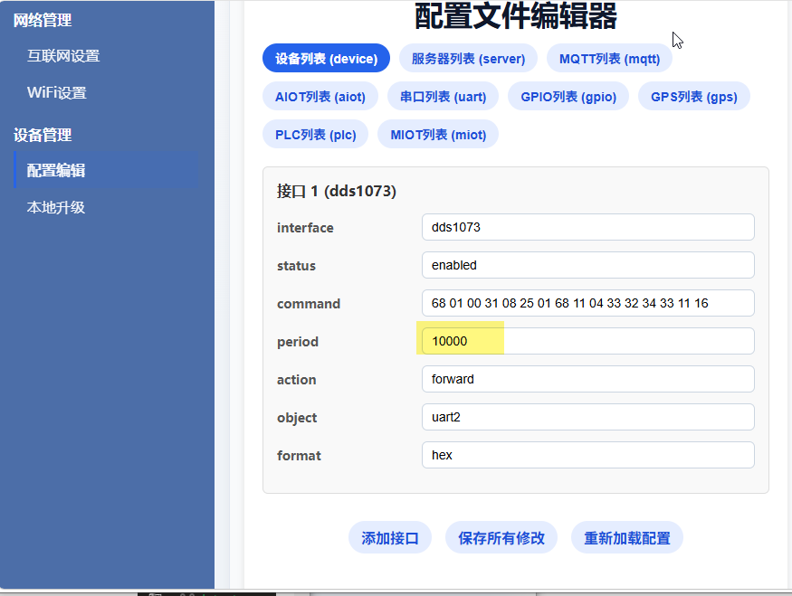
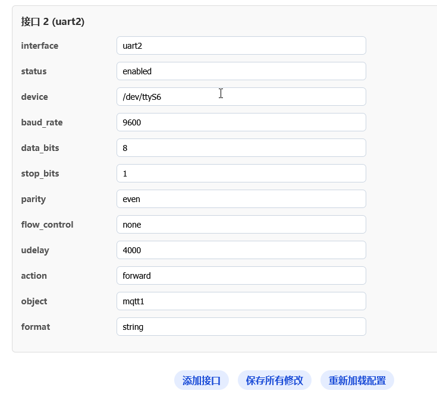
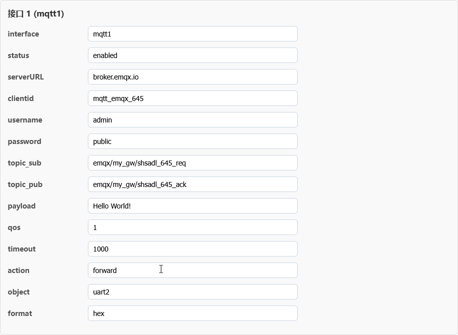
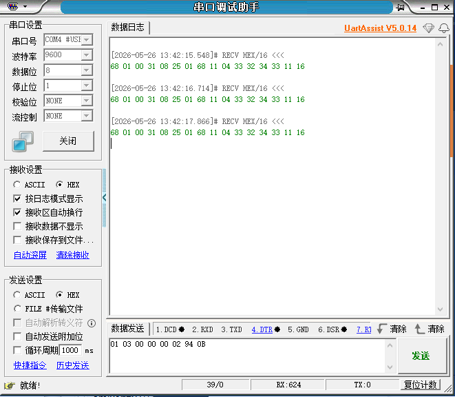
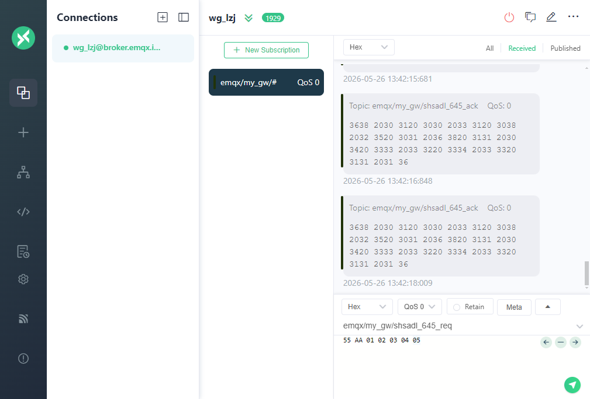
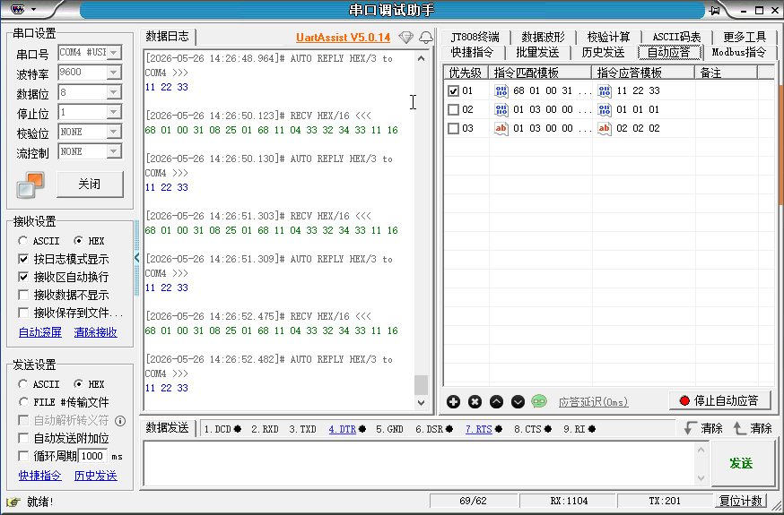

# 一、目标

将RS485电表（dds1079）的数据，通过网关转换为MQTT消息，上报到MQTT服务器

用户在电脑上的MQTT客户端（MQTTX）就能看到电表数据

**设备：**

​    网关开发板（内置 RS485 与以太网接口，运行网关程序）

​    RS485 电表 dds1079（或等效设备）

​    客户电脑（用于网页配置 + MQTT 客户端）

​    MQTT 服务器（可以是公网的 broker.emqx.io，也可以是客户自建）

# 二、设备连接

​    电表 A ↔ 网关 A2

​    电表 B ↔ 网关 B2

​    电表GND↔ 网关GND

网线连接开发板eth0，自动获取得到IP→192.168.128.243

# 三、网页端配置

## 1.网页配置

进入网址192.168.128.243

在界面点击“配置编辑”

### 设备列表配置

打印输出时间间隔为1000ms

## 2.串口列表配置

使用uart2接口，设备路径为ttyS6

## 3.**MQTT列表配置**

# 四、串口调试工具配置

波特率115200，接收和发送端都设置文本格式为HEX

# 五、MQTTX配置

如果你想看网关上传的数据（电表读数）

MQTTX 的 Topic 框里填： emqx/my_gw/shsadl_645_ack

如果你想看网关接收到的指令

MQTTX 的 Topic 框里填： emqx/my_gw/shsadl_645_req

按照之前已经完成的mqtt列表的配置来填

最推荐的填法（全通配符）

如果你想同时看到上面两种数据，直接填： emqx/my_gw/#

# 六、开始透传

## 上行透传

从设备主动上报，

（RS485设备→串口调试助手和网关→MQTT）

启动终端，连接开发板后，自动执行miot程序。

设备RS485主动发送数据68 01 00 31 08 25 01 68 11 04 33 32 34 33 11 16 给网关，网关经过格式转换得到数据3638 2030 3120 3030 2033 3120 3038 2032 3520 3031 2036 3820 3131 2030 3420 3333 2033 3220 3334 2033 3320 3131 2031 36并发送给MQTT服务端

## 下行透传（程序没做下行透传）

（MQTT→网关和调试串口→RS485设备）

主设备（电脑端）通过MQTT客户端发送数据68 01 00 31 08 25 01 68 11 04 33 32 34 33 11 16 

服务端将数据转发给网关，网关的miot程序接收到数据后，数据转换为16进制二进制数据，并通过RS485串口发出去

串口调试助手收到68 01 00 31 08 25 01 68 11 04 33 32 34 33 11 16 ，并应答11 22 33

存在问题：

1.启动开发板自动执行miot程序。终端一直刷新日志，关掉需要执行命令/etc/init.d/S99miot stop（不影响）

2.开机一直在串口调试打印68 01 00 31 08 25 01 68 11 04 33 32 34 33 11 16 ，MQTT一直收到数据3638 2030 3120 3030 2033 3120 3038 2032 3520 3031 2036 3820 3131 2030 3420 3333 2033 3220 3334 2033 3320 3131 2031 36

解决办法：在网页设置里面调长输出间隔为10秒。

3.串口调试助手（UartAssist V5.0.14）有些时候闪退，或者自动断联，再次连接显示串口被占用

解决办法：插拔RS485串口端，检查杜邦线是否松动，或者重启终端、MQTTX、

关掉电表，串口调试端口自动闪退，（改了网页配置的前提下）

# 对比TCP透传：

1.**数据格式差异**

MQTT：网关把串口数据转成带空格的字符串格式，大写字母（16进制数据）转换成小写字母，再按ASII编码发出去

TCP：网关直接发原始二进制数据，不会转换格式

2.**网关角色差异**

MQTT：网关是协议转换+格式转换的角色，处理MQTT连接和数据格式

TCP：网关是透明转发器，负责把串口数据原封不动转发到TCP，不做任何处理

3.**配置、开发、调试**

| 维度         |                          MQTT 透传                           | TCP 透传                                               |
| ------------ | :----------------------------------------------------------: | ------------------------------------------------------ |
| **协议栈**   | 基于 TCP 的应用层协议，额外有 MQTT 控制报文（CONNECT/PUBLISH/SUBSCRIBE 等） | 直接使用 TCP 协议，无额外协议封装                      |
| **网关配置** | 需要配置：Broker 地址、端口、Client ID、用户名 / 密码、发布 / 订阅主题、心跳间隔 | 只需要配置：目标 IP、端口、工作模式（客户端 / 服务端） |
| **数据处理** | 网关会做格式转换（如你遇到的`%02x`转字符串），上下行都需要解码 / 编码 | 完全透明转发，不修改数据内容，收发都是原始二进制       |
| **调试难度** | 需同时排查：网络连接、MQTT 会话、主题权限、数据格式转换问题  | 只需排查：TCP 连接是否正常、数据是否完整收发           |
| **开发依赖** |    设备侧可零开发，但云平台 / 客户端必须用 MQTT 协议解析     | 任意 TCP 客户端都能直接对接，无需额外协议支持          |

# RS485的广播特性

RS485 总线上，同时挂了三个东西：

主动发数据的 **RS485 设备**（数据源头）电表

**GW510 网关**（要转发数据到 MQTT）

你的 **USB 转 RS485 模块 + 串口调试助手**（电脑上的监听工具）

