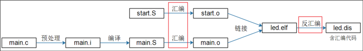

#  文件路径

## cd

开头带 / = 绝对路径；开头不带 / = 相对路径

cd /home/chensz（绝对路径）从根目录下寻找

cd <文件名字> 从当前目录找

cd /：回到系统根目录（真正的顶层）

cd .. ：回到上一级目录

cd ~ 或者cd →回到home目录（如果用户名是lizj，就进入目录/home/lizj）

# 文件命令

进入某个目录删除所有文件

```
cd /你要进的目录
rm -rf *
```

`rm -f`：只能删文件

`rm -rf`：才能删目录 + 里面所有内容

file hello:查看文件为什么系统编译

### ls

ls -F：列出文件，包括属性。后面带/表示文件夹，带*表示可执行文件，没有任何代表普通文件。

ls -al：能列出隐藏文件，隐藏文件一般为了防止误删。

# 解压命令

```
tar xvf xxx.tar 
```

>  把 tar 包解压到当前目录，并且打印解压清单

**x = extract【提取 / 解包】**

核心功能：从 tar 归档里释放文件，必选，代表解压模式。

**v = verbose【详细输出】**

可选：终端实时打印每一个正在解压的文件名；大文件不想刷屏就去掉 v，写成 `tar xf xxx.tar`。

**f = file【指定归档文件】**

f 必须放最后，后面紧跟压缩包名字，用来指定要操作的 tar 文件


# 文本编辑

vi <文件名>

i：进入编辑模式，ESC退出模式

保存并退出：：wq

退出不保存：:q!

# 挂载相关


```
mount -f nfs -o nolock,ver=3 (电脑home/book/nfs_rootfs /mnt（开发板的目录）
```

> -o：option；参数

# hello程序

```c++
#include <stdio.h>


/* 执行命令: ./hello weidongshan 
 * argc = 2
 * argv[0] = ./hello
 * argv[1] = weidongshan
 */

int main(int argc, char **argv)
{
	if (argc >= 2)
		printf("Hello, %s!\n", argv[1]);
	else
		printf("Hello, world!\n");
	return 0;
}
```

> **argc**：argument count，参数个数，整型

> **argv**：argument vector，参数数组，字符串指针数组

`char *`：**字符串**（字符指针，指向一串字符）

`char **`：**字符串数组**（指针的指针，指向多个字符串）

 头文件在系统目录也可以自己指定目录。

```
#argv[0]：程序名 ./hello
./hello lzj
```

访问自己的u盘，把它挂载到目录中

```
mount -t nfs 192.168.131.186:/C/User/test_file
#优化版
mount -t nfs -o vers=4 192.168.131.186:/C/User/test_file /mnt/nfs
```

> Windows NFS 默认 NFSv4
>

# GCC编译器的使用

## 编译过程

```
#预处理，编译，汇编，链接
gcc -o test test.c
#另外一种写法
gcc hello.c -o hello
```



> .i：**Intermediate preprocessed file** 中间文件
>
> `s` = Assembly（汇编）的首字母
>
> `o` = Object（目标、对象）首字母；

预处理：展开头文件，替换宏，删除注释，处理条件编译(ifdef/#endif)，生成#行号“文件名” 

> 处理条件编译：根据是否定义宏，裁剪对应代码段
>
> 生成#行号“文件名” ：记录当前代码来自哪个原始文件、对应原文件第几行。

### 常用编译选项

-c：做预处理，编译，汇编，不链接

-o：指定输出文件的名字

```
#不指定名称时，可执行文件固定为a.out
gcc test.c
#指定输出文件名字为test
gcc -o test test.c
```

-E：预处理，开发过程中想快速确认某个宏用“-E dM”

```
#查看预处理结果，比如头文件是哪一个
gcc -E main.c
#把所有宏展开存放到1.txt里面
gcc -E -dM main.c > 1.txt
```

### 编译多个文件

将两个c文件，编译链接成test可执行文件

```
gcc -o test main.c sub.c
```

分开编译，统一链接

```
gcc -c -o main.o main.c
gcc -c -o sub.o sub.c
gcc -o test main.o sub.o
```

### 制作、使用动态库

动态库Linux后缀.so（全称shared object共享对象）,把多个功能函数打包成独立文件

制作、编译

```
gcc -c -o main.o mian.c
gcc -c -o sub.o sub.c
#可使用多个.o生成动态库
gcc -shared -o libsub.so sub.o sub2.o sub3.o
gcc -o test main.o -lsub -L/libsub.so/所在目录/
```

可执行文件test依赖libsub.so

-L=Library search path 告诉编译器动态库libsub.so的路径

`-l` 是固定编译器参数

# Makefile

## 配套视频内容大纲

---

### 规则与示例

存为Makefile或者makefile文件，执行make命令时,才会执行

```
arm-linux-gcc –o hello hello.c
```

把hello.c文件作为依赖文件，若没有hello文件或者依赖文件修改时间比目标文件新，则执行下方编译命令

```
hello:hello.c
	gcc -o hello hello.c
```

运行“make clean”时，由于目标clean 没有依赖，它的命令“rm -f hello”
将被强制执行。

```
clean:
	rm -f hello
```

定义一个清理目标clean，清理编译产物

### 通用Makkefile的使用

- 支持多个目录 ，多层目录，多个文件夹
- 支持给所有文件设置编译选项，
- 支持给某个目录设置编译选项
- 支持给某个文件单独设置编译选项

### 通用Makefile解析

make命令作用

```
make -f Makefile.build
```

-f可以指定文件，不加-f就直接在当前目录查找Makefile文件

 

## Makefile规则

通俗解释：一个IDE工具，为X86编译

> 为IMX6ULL编译的为arm-buildroot-linux-gnueabihf-gcc

执行 make 命令，工具自动判断文件变更，按需完成编译

## Makefile文件赋值方法

延时变量、立即变量

<u>变量</u>

```
A ：=××× #A的值即刻确定，在定义时就确定→即时变量
B=×××	 #B的值使用到时才确定 →延时变量
```

```
A:=$(C)
B=$(C)
C=111
all:
	@echo A=$(A)
	@echo B=$(B)
#输出
A=
B=111
```

补充：

- ？=空赋值 延时变量，第一次定义才起效 如果前面该变量已定义，则忽略这句

- +=追加赋值	取决于前面的定义决定是即时还是延时

## Mekefile常用函数

#### 字符串替换和分析函数


#### 文件名函数

#### 其他函数


# 

1. 整条命令：

   ```
   
   ```
   
2. 为避免重复执行，所以先编译最后链接

   ```
   #c文件编译成.o目标文件
   gcc -c -o b.o b.c
   #链接 生成可执行文件test
   gcc -o test b.o
   ```

> `-c`：关键参数，停止在汇编阶段，不链接

3. 判断哪个文件被修改了→查看时间
    - 当依赖（b.o）比目标文件（test）新→重新链接
    - 当a.c比a.o新，重新编译


​	4. 、			

## 语法

<u>通配符%</u>

```
a.o:a.c
	gcc -c -o a.o a.c
	
%.o:%.c
	gcc -c -o $@ $<
```

<：表示第一个依赖文件 

```
test:a.o b.o
	gcc -o test a.o b.o
test:a.o b.o
	gcc -o test $^
```

^：表示所有的依赖文件

清除所有的.o文件

```
clean:
	rm *.o test
#终端执行
make clean
```

直接执行make，默认执行第一个目标（Makefile/makefile）

定义假象目标

```
.PHONY：clean
```

以免系统找不到目标，不会判断名为clean的文件是否存在

> phony：假想的

- 

## make函数

<u>foreach</u> 

```
A=a b c
B=$(foreach f,$(A),$(f).o)
all:
	@echo B=$(B)
#输出
B=a.o b.o c.o
```

> 批量把源码名转换成对应的 `.o` 目标文件

`foreach` 是 Makefile 内置循环函数，语法：

$(foreach 临时变量, 待遍历列表, 循环处理逻辑)

<u>filter</u>

```
A=a b c
B=$(foreach f,$(A),$(f).o)
C=a b c d/
D=$(filter %/,$(C))
E=$(filter-out %/,$(C))

all:
	@echo B=$(B)
	@echo D=$(D)
	@echo E=$(E)
#输出
B=a.o b.o c.o
D=d/
E=a b c
```

- filter：从列表中取出符合这个格式的值


- filter-out：从列表中取出不符合这个格式的值

## 实例

```
# 需要判断是否存在依赖文件
# .main.o.d .sub.o.d
dep_files := $(foreach f, $(objs), .$(f).d)
dep_files := $(wildcard $(dep_files))

# 把依赖文件包含进来
ifneq ($(dep_files),)
  include $(dep_files)
endif


%.o : %.c
        gcc -Wp,-MD,.$@.d  -c -o $@  $<


clean:
        rm *.o test -f

distclean:
        rm  $(dep_files) *.o test -f
```


# 文件IO

---

## 分类

- 系统调用IO：open/read/write/lseek/fsync/close
- 标准IO：fopen/fread/fwrite/fseek/fflush/fclose

> 标准 IO 通过 glibc（GNU C Library，GNU 标准 C 库）封装实现
>
> glibc包括系统io和标准io

**一、POSIX 系统调用与标准 IO 跨平台逻辑**

1. Linux、Unix 遵循统一 POSIX 系统调用接口，原生系统 IO在类 Unix 系统下接口一致，一套 IO 函数可跨 Linux/Unix 兼容运行。

2. Windows 内核原生不兼容 POSIX 系统调用，为实现程序跨 Windows / 类 Unix 平台可移植，诞生了标准 IO库。

   > POSIX（Portable Operating System Interface）可移植操作系统接口

   *总结：*

   ​	标准 IO 底层封装不同系统的内核读写函数，对外提供统一 API，屏蔽底层系统差异。

二、标准 IO 核心优势：提升读写效率（缓冲机制）

1. 第 1 次读取数据：触发系统调用进入内核，一次性读取 1KB 数据存入标准 IO 库缓冲区；
2. 后续 99 次读取请求：无需进入内核，直接从用户态缓冲区取数据，仅一次内核交互完成百次读取需求

​	*总结：*

​		标准 IO = 封装系统 IO 的标准化函数库；
​	核心设计思路：利用缓冲区批量读写，降低系统调用频次，大幅提升 	IO 吞吐效率。

## 函数

```
man man
```

> man：manual ；手册

manual分9个章节

分页器操作

1. 空格 /f：向下翻一页
2.  b：向上翻一页
3. 回车：向下滚动一行
4. q：退出 man 手册
5. `/关键词`：向下搜索文本，n 下一个匹配，N 上一个匹配
6. ? 关键词：向上搜索文本

使用open函数查看文件

查看函数

```
man 2 open
man 2 read
```

> 2章节属于内核态

> 3章节属于用户态（Library；库）

打印错误信息

```
man errno
man strerror
```

> errno = Error Number；错误码

使用open函数创建文件

```
#板子运行
arm-buildroot-linux-gnueabihf-gcc -o open open.c
#ubuntu运行
gcc -o open open.c
```

> fd：file descriptor 文件描述符
>

```
./open ./open.c &
```


## 系统调用接口的内部流程

系统(内核空间)和应用程序(用户空间)之间调用接口

分辨处理异常

怎么处理异常

设置触发异常的原因：

触发异常：执行汇编指令 swi,svc 调用open或者read函数

应用函数调用glibc实现系统IO函数

应用程序

fd文件句柄，得到一个file结构体

file descri

## 系统调用

## dup函数

> dup : duplicate file descriptor（复制文件描述符）
>
> `dup2`：duplicate file descriptor to specified fd（复制到指定文件描述符）
>
> `dup3`：duplicate file descriptor with flags（带标志位的复制 fd）


# 驱动

引脚普适方法

应用程序调用glibc所提供的open等函数，最终进入内核里面的sysopen sysread

驱动也有自己的驱动函数

把结构体注册到内核

注册：内核帮助文档

内核里面有一个数组

确认主设备号，也可以让内核确定

入口函数，安装驱动程序，出口函数


LED驱动程序框架

兼容多个开发板（公共部分）

驱动程序：drv_open，drv_read，drv_write，drv_ioctl

这些封装在自己的结构体file_operations

告诉内核调用register_chrdev


## 笔记

将compatible转换为platform device

节点直接挂载在根节点下，内核自动生成platform deivce
