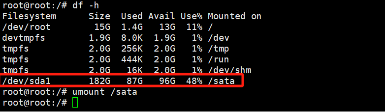
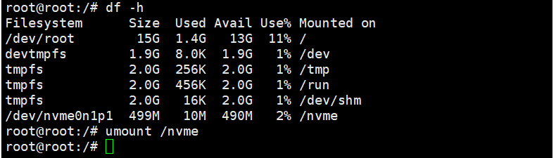
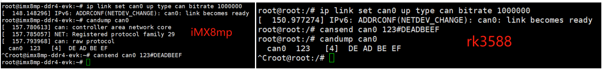
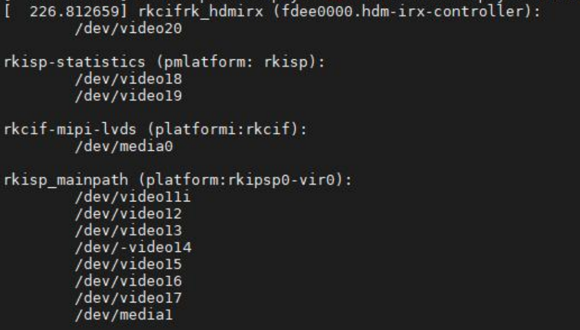

## 测试一览表

| 测试接口             | 结果 | 备注                                            |
| :------------------- | ---- | ----------------------------------------------- |
| 网口测试             | Fail | eth0是坏的                                      |
| USB测试              | Pass |                                                 |
| SD接口测试           | Pass |                                                 |
| 音频播放测试         | Pass | 测试命令里面写的通道2，实际为card 3；丝印应为P3 |
| 录音测试             | Fail | 丝印应为P3？接口不详                            |
| WiFi测试             | Pass | wlan1默认AP接口                                 |
| 蓝牙测试             | Pass |                                                 |
| SATA接口测试         |      | 没有4D转SATA供电线和SATA数据线                  |
| M.2接口测试          | Pass |                                                 |
| CAN测试              |      | 用不了                                          |
| 485测试              | Pass |                                                 |
| RTC测试              | Pass |                                                 |
| ADC按键测试          | Pass |                                                 |
| SPEAKER测试          |      | 不响                                            |
| mpp测试              | Pass | 生成解码视频                                    |
| 蜂鸣器测试           | Pass |                                                 |
| USB摄像头测试        |      | 设备数配置有问题                                |
| HDMI测试             |      | RX正常显示，TX没测                              |
| 多路视频播放测试     |      |                                                 |
| GPU测试              |      |                                                 |
| GPIO测试             |      | 没有丝印图                                      |
| WatchDog测试         | Pass |                                                 |
| 5G测试               |      | 没有SIM卡                                       |
| 摄像头模块ov5695测试 |      |                                                 |
| MIPI屏幕测试         |      |                                                 |

## 报告修改：

- 丝印标识有些对不上
- 在终端输入命令过长，显示有问题

Qt 版本：Qt 5.15.2

用户：root	密码：rockchip

## 网口测试

### 网口1

接口丝印：J13

系统接口：eth0

测试说明：采用开发板向PC发送ICMP报文的方式进行测试

测试操作

1.配置电脑有线网卡IP为 192.168.137.99

2.使用网线连接开发板网口和电脑的网口，串口显示信息：

```Plain
[  275.170629] rk_gmac-dwmac fe1c0000.ethernet eth0: Link is Up - 1Gbps/
```

3.默认是自动获取ip，但测试是配置静态ip来测，具体配置命令如下：

```C
ifconfig eth1 down
ifconfig eth0 up
ifconfig eth0 192.168.137.81
```

4.输入指令如下进行验证网口1：

```Bash
ping -I eth0 192.168.137.99 -c 2 -w 4
PING 192.168.137.99 (192.168.137.99) from 192.168.137.81 eth0: 56(84) bytes of data.
64 bytes from 192.168.137.99: icmp_seq=1 ttl=128 time=0.947 ms
64 bytes from 192.168.137.99: icmp_seq=2 ttl=128 time=0.588 ms

--- 192.168.137.99 ping statistics ---
2 packets transmitted, 2 received, 0% packet loss, time 1001ms
rtt min/avg/max/mdev = 0.588/0.767/0.947/0.179 ms
```

"0% packet loss"表示测试通过

如果出现"100% packet loss"，请先确认电脑的防火墙是否全部关闭

### 网口2

接口丝印：J14

系统接口：eth1

测试说明：采用开发板向PC发送ICMP报文的方式进行测试

测试操作

1.配置电脑有线网卡IP为 192.168.137.99

2.使用网线连接开发板网口和电脑的网口，串口显示信息：

```Plain
[  528.550794] IPv6: ADDRCONF(NETDEV_CHANGE): eth1: link becomes ready
```

3.默认是自动获取ip，但测试是配置静态ip来测，具体配置命令如下：

```C
ifconfig eth0 down
ifconfig eth1 up
ifconfig eth1 192.168.137.81
```

4.输入指令如下进行验证网口2：

```Bash
ping -I eth1 192.168.137.99 -c 2 -w 4
PING 192.168.137.99 (192.168.137.99) from 192.168.137.81 eth1: 56(84) bytes of data.
64 bytes from 192.168.137.99: icmp_seq=1 ttl=128 time=1.05 ms
64 bytes from 192.168.137.99: icmp_seq=2 ttl=128 time=0.575 ms

--- 192.168.137.99 ping statistics ---
2 packets transmitted, 2 received, 0% packet loss, time 1002ms
rtt min/avg/max/mdev = 0.575/0.812/1.049/0.237 ms
```

"0% packet loss"表示测试通过

如果出现"100% packet loss"，请先确认电脑的防火墙是否全部关闭

## USB测试

接口丝印：

1）J4

2）J29

3）P2

测试说明：采用插拔USB存储设备（U盘）的方式进行测试

测试操作

1.将USB设备插入底板USB接口，系统会输出类似如下信息：

```yaml
[ 1029.428426] usb 2-1.1: new high-speed USB device number 4 using ehci-platform
[ 1029.526593] usb 2-1.1: New USB device found, idVendor=abcd, idProduct=1234, bcdDevice= 1.00
[ 1029.526688] usb 2-1.1: New USB device strings: Mfr=1, Product=2, SerialNumber=3
[ 1029.526712] usb 2-1.1: Product: UDisk           
[ 1029.526733] usb 2-1.1: Manufacturer: General 
[ 1029.526753] usb 2-1.1: SerialNumber: 2401121918117820734311
[ 1029.528412] usb-storage 2-1.1:1.0: USB Mass Storage device detected
[ 1029.530317] scsi host1: usb-storage 2-1.1:1.0
[ 1030.543580] scsi 1:0:0:0: Direct-Access     General  UDisk            5.00 PQ: 0 ANSI: 2
[ 1030.545097] sd 1:0:0:0: [sda] 15728640 512-byte logical blocks: (8.05 GB/7.50 GiB)
[ 1030.545832] sd 1:0:0:0: [sda] Write Protect is off
[ 1030.546583] sd 1:0:0:0: [sda] No Caching mode page found
[ 1030.546595] sd 1:0:0:0: [sda] Assuming drive cache: write through
[ 1030.550462]  sda: sda1
[ 1030.553978] sd 1:0:0:0: [sda] Attached SCSI removable disk
[ 1030.778434] FAT-fs (sda1): utf8 is not a recommended IO charset for FAT filesystems, filesystem will be case sensitive!
[ 1030.782177] FAT-fs (sda1): Volume was not properly unmounted. Some data may be corrupt. Please run fsck.
```

2.将USB设备从底板拔出，系统会输出类似如下信息：

```C
[ 1066.341847] usb 2-1.1: USB disconnect, device number 4
```

## SD接口测试

接口丝印：J6

测试说明：采用插拔TF卡的方式进行测试

测试操作

1.将TF卡安装到SD接口，开发会输出如下信息：

```yaml
[  380.723829] dwmmc_rockchip fe2c0000.mmc: could not set regulator OCR (-22)
[  380.723921] dwmmc_rockchip fe2c0000.mmc: failed to enable vmmc regulator
[  380.736730] mmc_host mmc1: Bus speed (slot 0) = 400000Hz (slot req 400000Hz, actual 400000HZ div = 0)
[  380.892477] mmc_host mmc1: Bus speed (slot 0) = 49500000Hz (slot req 50000000Hz, actual 49500000HZ div = 0)
[  380.892687] mmc1: new high speed SDHC card at address 0001
[  380.894512] mmcblk1: mmc1:0001 TF 4G 3.68 GiB 
[  380.896321]  mmcblk1: p1
[  381.134266] FAT-fs (mmcblk1p1): utf8 is not a recommended IO charset for FAT filesystems, filesystem will be case sensitive!
[  381.140831] FAT-fs (mmcblk1p1): Volume was not properly unmounted. Some data may be corrupt. Please run fsck.
```

结果：操作后输出信息符合正确预期，表示正确识别到 TF 卡。

2.将TF拔出，输出信息如下：

```Plain
[  376.270975] mmc1: card 0001 removed
```

结果：操作时的现象符合正确预期，表示 TF 热插拔正常

## 音频播放测试

接口丝印：J16

测试说明：播放音频文件验证评估板的音频播放功能

测试操作

1.把耳机接入丝印对应的接口

2.输入指令如下进行测试：

查看rockchipes8388声卡及编号

```C
aplay -l
```

指定播放设备，hw:卡号,设备号

```Bash
aplay -D hw:3,0 test_app/music_test.wav
```

会输出如下信息

```Plain
Playing WAVE '/test_app/music_test.wav' : Signed 16 bit Little Endian, Rate 44100 Hz, Stereo
```

耳机有声音输出表示音频播放测试通过

## 录音测试

接口丝印：J15

测试说明：录制并播放录音文件进行测试

测试操作

1.把带MIC的耳机插入丝印对应的接口

2.输入如下指令进行10秒的录音：

```Bash
arecord -d 10 -f cd -r 44100 -c 2 -t wav record.wav
```

3.把耳机或者喇叭接入丝印J16对应的接口播放录制的音频文件，输入如下指令：

```Bash
aplay record.wav
```

耳机或者喇叭有录制声音输出表示录音测试通过

## Wifi测试

接口丝印：U19

测试说明：WIFI连接到AP后，开发板向外网发送ICMP报文来验证连接正常

测试操作

1.把WIFI天线连接到"U19"接口上

2.生成 SSID 的 WPA PSK 文件

```Plain
wpa_passphrase命令格式：wpa_passphrase + wifi名称 + wifi密码 > /etc/wpa_supplicant.conf
```

输入指令如下：

```Bash
wpa_passphrase MY-WIFI My202412 > /etc/wpa_supplicant.conf
```

3.连接，输入指令如下：

```Bash
wpa_supplicant -B -i wlan0 -c /etc/wpa_supplicant.conf
```

输出信息：

```Plain
Successfully initialized wpa_supplicant
nl80211: kernel reports: Authentication algorithm number required
[  266.744713] IPv6: ADDRCONF(NETDEV_CHANGE): wlan0: link becomes ready
```

4.获取IP，输入指令如下：

```Bash
udhcpc -i wlan0
```

输出信息：

```Plain
udhcpc: started, v1.36.0
udhcpc: broadcasting discover
udhcpc: broadcasting select for 192.168.61.187, server 192.168.60.1
udhcpc: lease of 192.168.61.187 obtained from 192.168.60.1, lease time 86400
deleting routers
adding dns 192.168.60.1
```

5.测试连接，输入指令如下：

```Bash
ping -I wlan0 www.baidu.com -c 3
```

输出信息：

```python
PING www.a.shifen.com (183.2.172.177) from 192.168.61.187 wlan0: 56(84) bytes of data.
64 bytes from 183.2.172.177 (183.2.172.177): icmp_seq=1 ttl=54 time=11.2 ms
64 bytes from 183.2.172.177 (183.2.172.177): icmp_seq=2 ttl=54 time=13.8 ms
64 bytes from 183.2.172.177 (183.2.172.177): icmp_seq=3 ttl=54 time=14.1 ms

--- www.a.shifen.com ping statistics ---
3 packets transmitted, 3 received, 0% packet loss, time 2003ms
rtt min/avg/max/mdev = 11.158/13.029/14.104/1.328 ms
```

结果："0% packet loss"表示wifi连接正常

## 蓝牙测试

接口丝印：U19

测试说明：扫描到蓝牙设备后，发送L2CAP回应请求并接收回答

测试操作

1.把天线连接到"U19"接口上

2.启动蓝牙，输入指令如下：

```Bash
hciconfig hci0 up
```

3.扫描外部蓝牙设备，输入指令如下：

```Bash
hcitool scan
```

输出：

```Plain
[  679.593805] rtk_btcoex: inquiry complete
        D0:57:7E:BF:9B:44        SZ-L0648
        10:38:1F:5C:61:9D        n/a
        7C:21:4A:C7:A2:21        PFBYRXUIAKYSFRJ
        74:B5:87:DB:09:7A        chensz
```

获取输出信息，需要的信息类似如下"        74:B5:87:DB:09:7A        chensz"

5.发送L2CAP包测试，输入指令如下：

```Bash
l2ping 74:B5:87:DB:09:7A
```

输出信息：

```python
root@root:/# l2ping 74:B5:87:DB:09:7A
Ping: 74:B5:87:DB:09:7A from C8:FE:0F:02:26:03 (data size 44) ...
0 bytes from 74:B5:87:DB:09:7A id 0 time 7.54ms
0 bytes from 74:B5:87:DB:09:7A id 1 time 14.19ms
0 bytes from 74:B5:87:DB:09:7A id 2 time 142.73ms
0 bytes from 74:B5:87:DB:09:7A id 3 time 111.30ms
0 bytes from 74:B5:87:DB:09:7A id 4 time 131.44ms
^C5 sent, 5 received, 0% loss
```

结果："0% packet loss"表示蓝牙连接正常

## SATA接口测试

接口丝印：J19、J2

测试说明：挂载硬盘后查看挂载情况

测试操作

1.开发板断电，接上SATA接口硬盘后启动开发板

2.创建挂载点并挂载硬盘，输入指令如下：

```Bash
mkdir /sata
mount /dev/sda1 /sata/
```

3.查看挂载情况，输入指令如下：

```Bash
df -h
```

挂载成功可获取类似输出"/dev/sda1       182G   87G   96G  48% /sata"

4.卸载硬盘，输入指令如下：

```Bash
umount /sata
```




## M.2接口测试

接口丝印：J20

测试说明：挂载硬盘后查看挂载情况

测试操作

1.开发板断电，接上M.2接口硬盘后启动开发板

2.创建挂载点并挂载硬盘，输入指令如下：

```Bash
mkdir /nvme
mount /dev/nvme0n1p1 /nvme/
```

3.查看挂载情况，输入指令如下：

```Bash
df -h
```

挂载成功可获取类似输出"/dev/nvme0n1p1  499M   10M  490M   2% /nvme" 

5.卸载硬盘，输入指令如下：

```Bash
umount /nvme
```




## can测试

接口丝印：J24

测试说明：与另一块带can口的开发板(笔者用的是imx8mp)互联进行收发测试

测试操作

1.连接两块板的can口后通电

2.配置can，两块板的输入指令如下：

rk3588：

```Bash
ip link set can0 up type can bitrate 1000000
```

imx8mp：

```Bash
ip link set can0 up type can bitrate 1000000
candump can0
```

3.rk3588发送数据，输入指令如下：

```Bash
cansend can0 123#DEADBEEF
```

imx8mp可以收到"can0  123   [4]  DE AD BE EF"，按下"Ctrl + C"退出接收

4.更改rk3588的can配置，imx8mp发送数据，输入指令如下：

rk3588：

```Bash
candump can0
```

imx8mp：

```Bash
cansend can0 123#DEADBEEF
```

rk3588可以收到"can0  123   [4]  DE AD BE EF"，按下"Ctrl + C"退出接收



操作过程中的输出符合预期即功能正常

## 485测试

接口丝印：J21

测试说明：通过485-USB转换头与电脑互联进行收发测试

测试操作

1.使用485-USB转换头连接开发板和电脑，三角形标志为1脚，对应转接头B，2脚对应A

2.使用`Xshell`打开对应串口,将波特兰设置成115200，数据为8位，停止位1位

3.输入如下命令

```Bash
/test_app/serial_test.out /dev/ttyS0 123456789
```

可以看到485串口终端输出`123456789`，然后进入接收模式

4.在485串口终端，直接输入123（不显示），板子输出结果：

```Bash
Starting send data...finish
Starting receive data:
ASCII: 0x31          Character: 1 
ASCII: 0x32          Character: 2 
ASCII: 0x33          Character: 3 
^C
```

按下"Ctrl + C"退出，操作过程中的输出符合预期即功能正常。

## rtc测试

接口丝印：BT1

测试说明：读取并设置时间，断电重启后检查时间是否正确

测试操作

1.断电，检查纽扣电池是否安装，用万用表检查RTC电池有没有电，测出来是3.3v左右才是正常的

2.设备通电，查看当前系统时钟，输入指令如下：

```Bash
date
```

输出信息：

```C
Wed May 14 02:06:10 UTC 2025
```

3.查看rtc时钟，输入指令：

```C
hwclock
```

输出信息：

```C
Wed May 14 02:06:20 2025  0.000000 seconds
```

4.设置系统时间

```C
date -s "2025-5-14 10:30:00"
```

5.将系统时间写入rtc，查看有没有成功写入，输入指令如下：

```Bash
hwclock -w
hwclock
```

输出信息：

```C
Wed May 14 10:30:10 2025  0.000000 seconds
```

与系统时间差不多，表示成功写入rtc。

5.设备断电重启，查看rtc时钟，输入指令如下：

```Bash
hwclock
```

输出信息：

```C
Wed May 14 10:30:43 2025  0.000000 seconds
```

rtc时间在原来的时间上继续走，表明rtc测试通过

## adc按键测试

接口丝印：sw2：vol+  sw6：pwron  sw3：reset  sw8：boot   sw7：back  sw5：menu   sw4：vol-

测试说明：

测试操作：

1.输入指令

```Plain
evtest
```

2.在输出信息查看并输入adc-keys的序号，分别按sw2、sw4、sw5、sw7

```yaml
Event: time 1746695171.863072, type 1 (EV_KEY), code 115 (KEY_VOLUMEUP), value 1
Event: time 1746695171.863072, -------------- SYN_REPORT ------------
Event: time 1746695172.069699, type 1 (EV_KEY), code 115 (KEY_VOLUMEUP), value 0
Event: time 1746695172.069699, -------------- SYN_REPORT ------------
Event: time 1746695175.273097, type 1 (EV_KEY), code 114 (KEY_VOLUMEDOWN), value 1
Event: time 1746695175.273097, -------------- SYN_REPORT ------------
Event: time 1746695175.376417, type 1 (EV_KEY), code 114 (KEY_VOLUMEDOWN), value 0
Event: time 1746695175.376417, -------------- SYN_REPORT ------------
Event: time 1746695176.719601, type 1 (EV_KEY), code 139 (KEY_MENU), value 1
Event: time 1746695176.719601, -------------- SYN_REPORT ------------
Event: time 1746695176.926343, type 1 (EV_KEY), code 139 (KEY_MENU), value 0
Event: time 1746695176.926343, -------------- SYN_REPORT ------------
Event: time 1746695180.026539, type 1 (EV_KEY), code 158 (KEY_BACK), value 1
Event: time 1746695180.026539, -------------- SYN_REPORT ------------
Event: time 1746695180.233035, type 1 (EV_KEY), code 158 (KEY_BACK), value 0
Event: time 1746695180.233035, -------------- SYN_REPORT ------------
```

## SPEAKER测试

接口丝印：J17

测试说明：接口有4个脚，2个有三角标志，接一个三角一个没有三角的管脚即可。

测试操作

1.输入如下指令

```Plain
aplay test_app/music_test.wav
aplay -D hw:3,0 test_app/music_test.wav
```

喇叭发出声音，表示测试通过。

## mpp测试

测试操作

1.解码视频，在串口终端输入如下指令：

```Plain
mpi_dec_test -i /oem/200frames_count.h264 -t 7 -n 250 -o /test.yuv -w 640 -h 480
```

将 h264 转为 yuv，在当前目录下生成test.yuv

2.编码视频，在串口终端输入如下指令：

```Plain
mpi_enc_test -i /test.yuv -t 7 -n 250 -o /test.h264 -w 640 -h 480 -fps 25
```

将 yuv 转为 h264，在当前目录下生成test.h264。

## 蜂鸣器测试

接口丝印：BP1

测试说明：设置PWM，打开和关闭蜂鸣器进行测试

测试操作

1.设置PWM，输入如下指令：

```Bash
echo 0 > /sys/class/pwm/pwmchip2/export
echo 366300 > /sys/class/pwm/pwmchip2/pwm0/period
echo 260000 > /sys/class/pwm/pwmchip2/pwm0/duty_cycle
```

2.打开蜂鸣器，输入如下指令：

```Bash
echo 1 > /sys/class/pwm/pwmchip2/pwm0/enable
```

3.关闭蜂鸣器，输入如下指令：

```Bash
echo 0 > /sys/class/pwm/pwmchip2/pwm0/enable
```

蜂鸣器可以正常的打开和关闭表示测试通过。

## usb摄像头测试

测试说明：摄像头拍摄的画面显示在显示屏上验证摄像头功能

测试操作

1.在其中一个usb接口接上usb摄像头。

2.查看摄像头设备：

```C
v4l2-ctl --list-devices
```

输出信息底部：

```C
Full HD webcam: Full HD webcam (usb-xhci-hcd.10.auto-1):
        /dev/video21
        /dev/video22
        /dev/media2
```

3.查看摄像头格式指令：

```C
v4l2-ctl --list-formats-ext -d /dev/video21
```

4.摄像头采集格式查询指令：

```C
v4l2-ctl -V -d /dev/video21
```

5.播放拍摄画面指令：

```Plain
gst-launch-1.0 v4l2src device=/dev/video21 \
! 'image/jpeg,width=1920,height=1080,framerate=30/1' \
! jpegdec \
! videoconvert \
! autovideosink
```

输出如下信息：

```Plain
Setting pipeline to PAUSED ...
Pipeline is live and does not need PREROLL ...
Pipeline is PREROLLED ...
Setting pipeline to PLAYING ...
New clock: GstSystemClock
Redistribute latency...
0:00:08.6 / 99:99:99.
```

HDMI界面会出现摄像头的画面。

## HDMI测试

### HDMI_TX

接口丝印：J8、J9

测试说明：

测试操作：

1.将一个HDMI接口的屏幕和开发板上任意一个对应丝印接口连接，便会出现系统的画面。

2.将两个HDMI接口的屏幕分别和开发板上对应丝印接口连接，默认双屏同显

显示屏正常显示表示测试通过

### HDMI_RX

接口丝印：J7

测试说明：查看是否生成对应的设备节点

测试操作

1.将 HDMI_RX 与电脑端口连接(注：主机不能接显示屏)

2.HDMI-IN 设备在内核中会被注册为 video 设备，生成的节点如：/dev/video20，在HDMI界面终端输入以下

命令查看是否有 hdmiin 生成的设备节点（如果串口中端找不到设备）：

```Bash
v4l2-ctl --list-devices
```



3.输入如下命令

```C
gst-launch-1.0 v4l2src device=/dev/video20 ! videoconvert ! autovideosink
```

输出：

```C
Setting pipeline to PAUSED ...
Using mplane plugin for capture 
Pipeline is live and does not need PREROLL ...
Pipeline is PREROLLED ...
Setting pipeline to PLAYING ...
New clock: GstSystemClock
[  159.986595] fdee0000.hdmirx-controller: hdmirx_start_streaming: delay_line:720
Redistribute latency...
[  160.622139] fdee0000.hdmirx-controller: rcv frames
0:00:47.3 / 99:99:99.
```

若显示主机的画面，表示测试通过。

## 多路视频播放测试

测试说明：

在HDMI界面打开`multivideoplayer`,循环播放9路视频

## GPU测试

测试说明：

在HDMI界面左下角，打开`图标3D字样`的程序，打开后cpu温度偏高。

测试完成后会显示如下信息：

```Plain
=======================================================
                                  glmark2 Score: 2281 
=======================================================
child 1905 exited
```

## GPIO测试

| 丝印   | J23：1   | J23：2   | J23：3   | J23：4   | J23：5   | J23：6 |
| ------ | -------- | -------- | -------- | -------- | -------- | ------ |
| GIPO   | GPIO3_B6 | GPIO3_A6 | GPIO4_C3 | GPIO2_C3 | GPIO2_C4 | GND    |
| 高电平 | 3.3V     | 3.3V     | 1.8V     | 1.8V     | 1.8V     | -      |

测试操作

1.输入如下指令使J23：2处于高电平：

```C
/test_app/gpio_test.out GPIO3_A6 1
```

输出

```C
Set GPIO102 HIGH
```

使用万用表测该管脚，3.3V表示测试成功。

2.输入如下指令使J23：2处于低电平：

```C
/test_app/gpio_test.out GPIO3_A6 0
```

输出

```C
Set GPIO102 LOW
```

使用万用表测该管脚，0V表示测试成功。

3.中断检测，触发方式为下降沿触发，将管脚J23：1和J23：2使用杜邦线连接，输入如下指令使管脚进入中断检测

```C
/test_app/gpio_test.out GPIO3_B6 irq &
```

把GPIO3_A6拉高再拉低，以达到下降沿触发条件

```C
/test_app/gpio_test.out GPIO3_A6 1
/test_app/gpio_test.out GPIO3_A6 0
```

输出

```C
GPIO110 interrupt detected! Value: 0
```

如上结果达到测试如此预期，表示测试成功。

## Watchdog测试

【测试说明】：开启看门狗，并使应用程序喂狗。

【接口标识】：无

【系统设备】：/dev/watchdog

测试操作

1.启动测试程序并设置超时时间为 4 秒，喂狗间隔为 2 秒：

```C
/test_app/wdt_driver_test.out 4 2 1 &
```

程序会周期性向 `/dev/watchdog` 喂狗，系统不会重启，持续运行表示测试成功。

2.启动测试程序并设置超时时间为 10 秒，喂狗间隔为 15 秒（超过超时）：

```C
/test_app/wdt_driver_test.out 10 15 1
```

系统自动重启，表示测试成功。

如上结果达到测试如此预期，表示测试成功。

## 5G测试

接口丝印：U25、CON1

测试说明：5G连接成功后，开发板向外网发送ICMP报文来验证连接正常

测试操作

1.开发板断电，将5G模块接入U25对应丝印接口、SIM卡接入CON1对应丝印接口，连接好5G模块的天线

2.开发板通电，输入以下指令进行拨号：

```Bash
./app/03_4g/quectel-CM &
ping -I rmnet_usb0.1 www.baidu.com -c 3
```

"0% packet loss"表示5G测试通过

3.输入以下指令关闭对应后台进程：

```Bash
pkill -f "./app/03_4g/quectel-CM"
```

操作过程中的输出符合预期即功能正常

## 摄像头模块ov5695测试

接口丝印：U17、U16、U13、U15

测试说明：在HDMI屏幕看摄像头的实时预览。

测试操作

1.开发板断电，将摄像头模块接入U17对应丝印接口。

2.开发板通电，输入以下指令实时预览：

```Bash
gst-launch-1.0 v4l2src device=/dev/video44 ! \
  video/x-raw,format=NV12,width=1920,height=1080,framerate=30/1 ! \
  waylandsink rotate-method=90l
```

3.如需测试其他csi接口

逆时针数U17、U16、U13、U15，
rkisp 主路径分别对应/dev/video44、/dev/video53、/dev/video71、/dev/video62，

播放其他摄像头修改一下指令的rkisp 主路径即可。

## mipi屏幕测试

接口丝印：J10、J11

测试说明：

测试操作

1.刷入mipi镜像，开发板断电，将mipi屏幕对应丝印接口。

2.开发板通电屏幕输出系统界面。

操作过程中的输出符合预期即功能正常