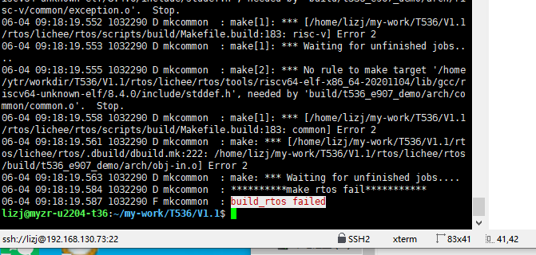

## 编译环境要求

编译主机需在ubuntu系统中进行，笔者主机系统为Ubuntu 22.04

## 依赖安装

首次编译可能需要安装某些依赖，下面给出主机可能需要安装的某些依赖:

```C
sudo apt-get install build-essential subversion git-core libncurses5-dev zlib1g-dev gawk flex quilt libssl-dev xsltproc \
libxml-parser-perl mercurial bzr ecj cvs unzip lib32z1 lib32z1-dev lib32stdc++6 libstdc++6 libc6:i386 libstdc++6:i386 \
lib32ncurses-dev lib32z1 ncurses-term bison libexpat1-dev -y
```

## 编译

### 编译配置

## 第一步：修复 python 缺失（T536 Tina 必装）

Ubuntu22.04 只有`python3`，没有`python`软链接，执行下面一条命令：

```
sudo apt install -y python-is-python3 python3-dev
```

```
./build.sh config
```

按如下要求选择配置

```C
All available platform:
   0. android
   1. linux
Choice [linux]: 1
All available linux_dev:
   0. bsp
   1. ubuntu
   2. buildroot
Choice [buildroot]: 2
All available ic:
   0. t536
Choice [t536]: 0
All available board:
   0. demo
   1. demo_amp
   2. demo_kylo
   3. demo_nand
   4. demo_nor
   5. demo_raw_nand
   6. myzr_t536_ek270
   7. myzr_t536_ek270_amp
   8. myzr_t536_ek270_e907
Choice [myzr_t5366_ek270]: 6
All available flash:
   0. default
   1. nor
Choice [default]: 0
All available kern_name:
   0. linux-5.10-euler
   1. linux-5.10-origin
   2. linux-5.10-rt
   3. linux-5.10-xenomai
   4. linux-5.15-origin
       1
```

### **整体编译**




交叉编译器路径硬编码写死为 /home/ytr/workdir/T536/...，但你实际工程路径是 /home/lizj/my-work/T536/V1.1，路径对不上找不到编译器头文件 stddef.h

cd rtos/lichee/rtos/tools/riscv64-elf-x86_64-20201104

```
/home/lizj/my-work/T536/V1.1/rtos/lichee/rtos/tools/riscv64-elf-x86_64-20201104
```

### 备选方案：创建软链接（用这个）

直接模拟原来 ytr 的目录路径，不用改配置：

```
#在系统里凭空造出作者原来的目录架
sudo mkdir -p /home/ytr/workdir/T536/
#不用了就删
sudo rm /home/ytr/workdir/T536/V1.1
#在/home/ytr/workdir/T536/里建一个名叫V1.1的快捷方式，点开这个快捷方式直接跳转到你现在的 V1.1 源码文件夹。
sudo ln -s $PWD /home/ytr/workdir/T536/V1.1
#清理残留编译后再执行编译
rm -rf rtos/lichee/rtos/build

```

`-p`：自动一次性创建多层不存在的目录（`/home/ytr`、`workdir`没有也自动生成，不报错）

`ln -s` = 创建**软链接（Windows 快捷方式）**

`$PWD` = **你当前所在文件夹的全路径（就是你的 V1.1 真实源码目录）**

后半段`/home/ytr/workdir/T536/V1.1` = 快捷方式存放位置

```
./build.sh
```

```
./build.sh pack
```

### **单独编译**

单独编译bootloader

```C
./build.sh bootloader
    #清理操作
    ./build.sh clean_bootloader
    #全部清除
    ./build.sh clean_all
```

### 单独编译内核

```C
./build.sh kernel
```

### 单独编译buildroot rootfs

```C
./build.sh buildroot_rootfs
```

### 打包（每次编译需要打包）

```C
source build/envsetup.sh
```

### **更多编译命令**

```C
source buildc /envsetup.sh
```

### **编译镜像的位置**

```C
out/t536_linux_myzr_t536_ek270_uart0_linux-5.10-origin.img
```


