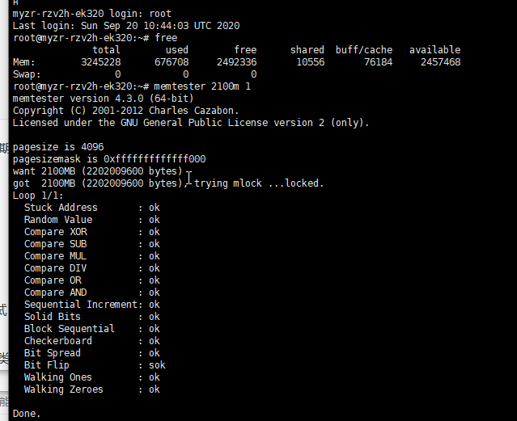
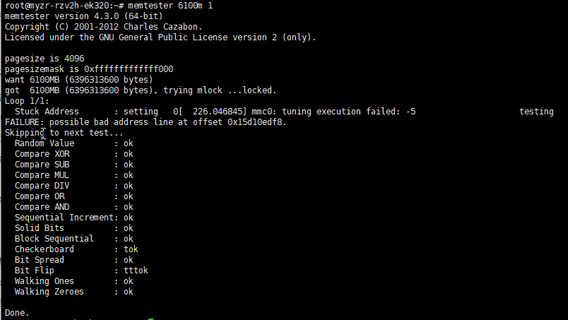

| 测试项       | 测试结果 | 备注               |
| ------------ | -------- | ------------------ |
| 电源指示灯   | Pass     | LD5亮，文档写的LD6 |
| 电源开关     | Pass     |                    |
| 复位按键     | Pass     |                    |
| 系统指示灯   | Pass     |                    |
| 内存压力测试 | Pass     |                    |
| USB          | Pass     | 手动挂载           |
| 网口         | Pass     |                    |
| TF卡         | Fail     |                    |
| HDMI         | Pass     |                    |
| USB 摄像头   |          | 没有摄像头         |
| M.2 SSD      | Pass     |                    |
| M.2 WiFi     |          | 没有固件           |
| M.2 5G       |          |                    |
| Mipi CSI     |          |                    |

```
amixer -q cset name='Aux Switch' on
amixer -q cset name='Mixin Left Aux Left Switch' on
amixer -q cset name='Mixin Right Aux Right Switch' on
amixer -q cset name='ADC Switch' on
amixer -q cset name='Mixout Right Mixin Right Switch' off
amixer -q cset name='Mixout Left Mixin Left Switch' off
amixer -q cset name='Headphone Volume' 70%
amixer -q cset name='Headphone Switch' on
amixer -q cset name='Mixout Left DAC Left Switch' on
amixer -q cset name='Mixout Right DAC Right Switch' on
amixer -q cset name='DAC Left Source MUX' 'DAI Input Left'
amixer -q cset name='DAC Right Source MUX' 'DAI Input Right'
amixer -q sset 'Mic 1 Amp Source MUX' 'MIC_P'
amixer -q sset 'Mic 2 Amp Source MUX' 'MIC_P'
amixer -q sset 'Mixin Left Mic 1' on
amixer -q sset 'Mixin Right Mic 2' on
amixer -q sset 'Mic 1' 90% on
amixer -q sset 'Mic 2' 90% on
amixer -q sset 'Lineout' 80% on
amixer -q set "Headphone" 100% on
alsactl store
systemctl enable alsa-restore.service
```


USB：

```
root@myzr-rzv2h-ek320:~# [  149.452705] imx462 0-001f: cannot get pwn-gpios
[  149.458086] imx462 1-001f: cannot get pwn-gpios
[  149.463427] imx462 2-001f: cannot get pwn-gpios
[  149.468793] imx462 3-001f: cannot get pwn-gpios
[  150.465488] sd 0:0:0:0: [sda] No Caching mode page found
[  150.470831] sd 0:0:0:0: [sda] Assuming drive cache: write through
[  150.528206] imx462 0-001f: cannot get pwn-gpios
[  150.533501] imx462 1-001f: cannot get pwn-gpios
[  150.538770] imx462 2-001f: cannot get pwn-gpios
[  150.543959] imx462 3-001f: cannot get pwn-gpios
```

TF

```
root@myzr-rzv2h-ek320:~# [  689.232815] mmc1: card never left busy state
[  689.237097] mmc1: error -110 whilst initialising SD card
[  690.627697] mmc1: card never left busy state
[  690.631962] mmc1: error -110 whilst initialising SD card
[  692.206498] mmc1: card never left busy state
[  692.210795] mmc1: error -110 whilst initialising SD card
[  693.599289] mmc1: card never left busy state
[  693.603554] mmc1: error -110 whilst initialising SD card
[  695.178429] mmc1: card never left busy state
[  695.182693] mmc1: error -110 whilst initialising SD card
[  695.793086] mmc1: error -110 whilst initialising SD card
```


```
root@myzr-rzv2h-ek320:~# free
              total        used        free      shared  buff/cache   available
Mem:        3245228      675880     2493284       10560       76064     2458316
Swap:             0           0           0
```


```
total ≈ 3169MB
used ≈ 660MB
free ≈ 2435MB
shared ≈ 10MB
buff/cache ≈ 74MB
available ≈ 2400MB
```


###  total

Linux 系统**能管理的总内存池大小**

不是硬件物理总内存！

你硬件是 4GB (4096MB)，差值约 900MB 是开机直接划走的预留内存：TEE 安全区、CMA (ISP/Codec/AI)、硬件加速器独占内存，这部分内核不开放给普通用户程序，不会计入 total。

### 2. used

已经被进程、内核、驱动**正在占用**的内存

当前 660MB：系统后台服务、串口、I2C、摄像头驱动、shell、后台守护程序占用，数值很小，负载很低。

### 3. free

完全空白、没任何数据的纯空闲内存（几乎无程序使用）

嵌入式系统会尽量把空闲内存拿去做文件缓存，所以 free 数值大代表当前业务负载极低。

### 4. shared

多个进程共享占用的内存（共享库、共享缓冲区）

你的板子只有 10MB，几乎可以忽略，代表没有多进程大内存共享业务。

### 5. buff/cache

缓冲区 + 页面缓存，Linux 自动利用空闲内存加速读写：

- buff：块设备缓存（eMMC/SD 卡读写缓冲）

- cache：文件、程序代码缓存

  

  这部分内存

  可回收

  ，当应用需要内存时系统会立刻释放，不算被永久占用。

  

  你这里只有 74MB，说明几乎没有频繁读写存储的操作。

### 6. available（最重要指标，内存测试必看）

**应用程序真正能申请使用的最大内存**

公式：`available = free + 可回收buff/cache - 预留不可回收内存`

你的数值≈2400MB，文档给的 4GB 板测试命令`memtester 2100m 1`就是小于 2400MB，所以能正常跑完不 OOM；

如果 memtester 后面跟的数字超过 available，会直接触发内核杀死进程（Killed）。




板2


| 测试项       | 测试结果 | 备注               |
| ------------ | -------- | ------------------ |
| 电源指示灯   | Pass     | LD5亮，文档写的LD6 |
| 电源开关     | Pass     |                    |
| 复位按键     | Pass     |                    |
| 系统指示灯   | Pass     |                    |
| 内存压力测试 | Fail     | 内存只识别一片     |
| USB 2.0      | Fail     |                    |
| 网口         | Pass     |                    |
| TF卡         | Fail     |                    |
| HDMI         | Pass     |                    |
| USB 摄像头   |          | 没有摄像头         |
| M.2 SSD      | Pass     |                    |
| M.2 WiFi     |          | 没有固件           |
| M.2 5G       |          |                    |
| Mipi CSI     |          |                    |




total = used + free + buff/cache

用户名变色

```
export PS1="\033[31m\u\033[0m@\033[32m\h\033[0m:\033[34m\w\033[0m# "
```

31 红、32 绿、33 黄、34 蓝、35 紫、36 青、37 白