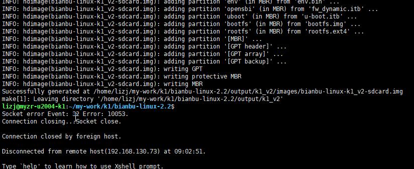

# 编译手册

本文档介绍SDK源码的开发环境、下载和编译方式。

## 开发环境

### 操作系统

笔者使用的是：Ubuntu 20.04

### 安装依赖

Ubuntu 20.04:

替换源

```
sudo sed -i s#archive.ubuntu.com#mirrors.tuna.tsinghua.edu.cn# /etc/apt/sources.list
```

更新系统

```
sudo apt update && apt upgrade -y
```

```shell
sudo apt-get -y install git build-essential cpio unzip rsync file bc wget python3 python-is-python3 libncurses5-dev libssl-dev dosfstools mtools u-boot-tools flex bison python3-pip
```

```
sudo pip3 install pyyaml
```

### 配置

#### buildroot

配置：

```shell
make menuconfig
```


保存配置，默认保存到`buildroot-ext/configs/spacemit_k1_v2_defconfig`：

```shell
make savedefconfig
```


#### linux

配置：

```shell
make linux-menuconfig
```


保存配置，默认保存到`bsp-src/linux-6.6/arch/riscv/configs/k1_defconfig`：

```shell
make linux-update-defconfig
```


#### u-boot

配置：

```shell
make uboot-menuconfig
```


保存配置，默认保存到`bsp-src/uboot-2022.10/configs/k1_defconfig`：

```shell
make uboot-update-defconfig
```

## 完整编译

```
make envconfig
```


生成的文件bianbu-linux-2.2/output\k1_v2/images/bianbu-linux-k1_v2.zip。



镜像位置

```
/home/lizj/my-work/k1/bianbu-linux-2.2/output/k1_v2/images/bianbu-linux-k1_v2-sdcard.img
```


## 单独编译

### 编译指定包

#### 编译内核：

```shell
make linux-rebuild
```


#### 编译u-boot：

```shell
make uboot-rebuild
```


编译指定包之后，可以将编译文件打包成bianbu-linux-2.2/output\k1_v2/images/bianbu-linux-k1_v2.zip。

```shell
make
```


buildroot支持编译指定package，可以`make help`查看指南。

### gcc单独编译

#### 搭建环境

交叉编译器下载地址：`http://archive.spacemit.com/toolchain/`，解压即可使用。

例如`spacemit-toolchain-linux-glibc-x86_64-v1.0.0.tar.xz`：

```shell
sudo tar -Jxf /path/to/spacemit-toolchain-linux-glibc-x86_64-v1.0.0.tar.xz -C /opt
```


设置环境变量：

```shell
export PATH=/opt/spacemit-toolchain-linux-glibc-x86_64-v0.3.3/bin:$PATH
export CROSS_COMPILE=riscv64-unknown-linux-gnu-
export ARCH=riscv
```


#### 编译 opensbi

```shell
cd bsp-src/opensbi
make -j$(nproc) PLATFORM_DEFCONFIG=k1_defconfig PLATFORM=generic
```


编译最终生成 `platform/generic/firmware/fw_dynamic.itb`。

#### 编译 u-boot

```shell
cd bsp-src/uboot-2022.10
make k1_defconfig
make -j$(nproc)
```


编译会根据 `board/spacemit/k1-x/k1-x.env` 生成 `u-boot-env-default.bin`，对应分区表 `env` 分区的镜像，以及生成 `FSBL.bin` 和 `u-boot.itb`。

#### 编译linux

```shell
cd bsp-src/linux-6.6
make k1_defconfig
LOCALVERSION="" make -j$(nproc)
```

编译最终生产Image和k1-x_deb1.dtb。


grep -rl "gx09inx101" ./ | xargs sed -i 's/gx09inx101/inx101/g'

sdk:

bianbu-linux-2.2.tar.gz

使用方式

直接解压：tar xf bianbu-linux-2.2.tar.gz -C sdk/