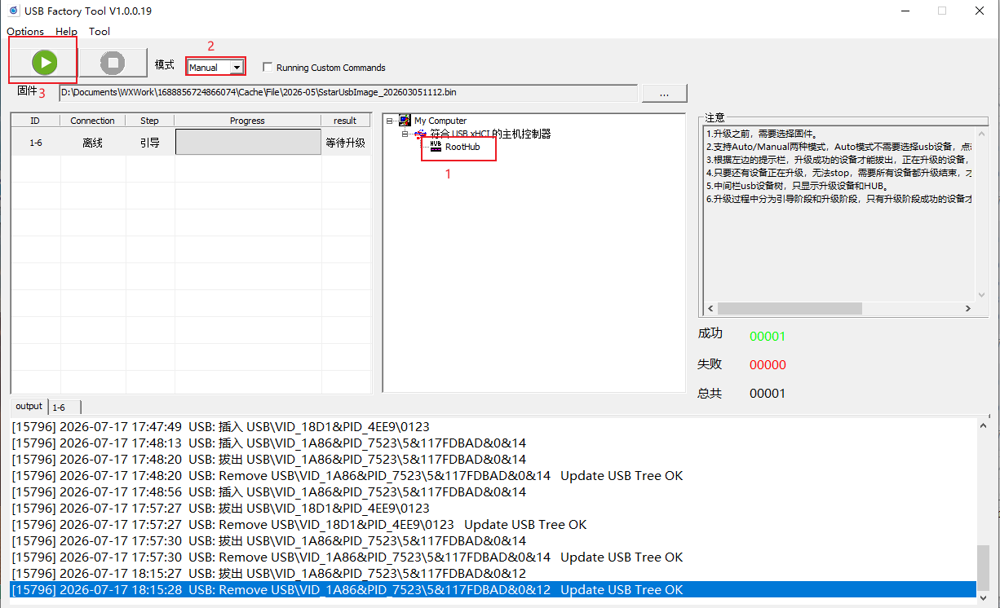
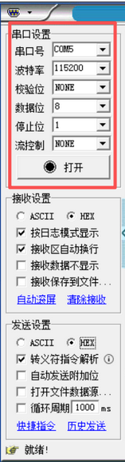

镜像烧录



## 设备连接

​    电表 A ↔ 网关 A2

​    电表 B ↔ 网关 B2

​    电表GND↔ 网关GND


网线连接开发板eth0，自动获取得到IP→192.168.128.243

## 网页端配置

1.网页配置

进入网址192.168.128.243

在界面点击“配置编辑”

设备列表配置


打印输出时间间隔为1000ms

2.串口列表配置

使用uart2接口，设备路径为ttyS6


3.**MQTT列表配置**


## 串口调试工具配置

波特率115200，接收和发送端都设置文本格式为HEX



## MQTTX配置

如果你想看网关上传的数据（电表读数）

MQTTX 的 Topic 框里填： emqx/my_gw/shsadl_645_ack

如果你想看网关接收到的指令

MQTTX 的 Topic 框里填： emqx/my_gw/shsadl_645_req

按照之前已经完成的mqtt列表的配置来填


最推荐的填法（全通配符）

如果你想同时看到上面两种数据，直接填： emqx/my_gw/#


## 开始透传

上行透传

从设备主动上报，

（RS485设备→串口调试助手和网关→MQTT）

启动终端，连接开发板后，自动执行miot程序。

设备RS485主动发送数据68 01 00 31 08 25 01 68 11 04 33 32 34 33 11 16 给网关，网关经过格式转换得到数据3638 2030 3120 3030 2033 3120 3038 2032 3520 3031 2036 3820 3131 2030 3420 3333 2033 3220 3334 2033 3320 3131 2031 36并发送给MQTT服务端


```
/etc/init.d/S99miot stop
/etc/init.d/S99miot sta
```

## 英文释义

| 英文   | 中文   |
| ------ | ------ |
| Manual | 手动的 |
|        |        |
|        |        |
|        |        |
|        |        |
|        |        |
|        |        |
|        |        |
|        |        |

