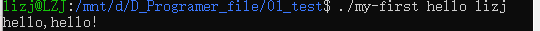

Framebuffer应用编程

文字显示及图像显示

输入系统应用编程

网络通信

多线程编程

## helloworld

```
#include <stdio.h>
int main(int argc,char **argv)
{
	if(argc >=2)
		printf("hello,%s!\n",argv[1]);
	else
		printf("hell,world!\n");
    return 0;
}
```

```
#查看上一个程序的退出码
 echo $?
```

```
#编译链接成一个可执行文件
gcc -o hello hello.c
```

> 预处理、编译、汇编、链接
>
> c、i、s、o、可执行文件

```
预处理：展开头文件、宏替换、删除注释、条件编译
```

> 条件编译：含#的预处理指令
>
> ```
> #if
> #ifdef
> #ifndef
> #elif
> #else
> #endif
> ```

```
#交叉编译工具链
arm-buildroot-linux-gnuebinf-gcc -o hello hello.c
```

> 编译发生的平台和生成程序运行的平台不一样→交叉
>
> gun：采用GUN标准C库（glibc）
>
> `eabihf`：ARM EABI，hard-float

执行文件



其中，也算连接符，会把hello,lizj识别成一个字符

程序的argv[0]存程序的名字

一极指针存储h的地址，二级指针存储hello首地址

## gcc

```
#先编译 不链接
gcc -c -o hello hello.c
#链接
gcc -o hello hell.o
```

> ```
> #查看步骤
> gcc -o hello hello.c -v
> ```

```
#编译多个文件
gcc -o test a.c b.c
```

```
#分开编译 统一链接
gcc -c -o a.o a.c
gcc -c -o b.o b.c
#链接
gcc -o c a.o b.o
```

> 链接：生成的OBJ 文件和系统库的OBJ 文件、库文件链接起来，最
> 终生成了可以在特定平台运行的可执行文件

## 动态库

也叫共享库，在Linux下通常是.so文件

程序**运行时**再去加载这个库

多个程序可以**共享同一个库文件**

库里的代码不需要被每个可执行文件都“复制一份”进去

```
静态库是编译/链接就把代码合并进可执行文件
动态库是运行阶段再合并
```

```

gcc -c -o sub.o sub.c
#生成动态库
gcc -shared -o libsub.so sub.o sub2.o sub3.o
#链接动态库
gcc -o test main.o -lsub -L /libsub.so/所在目录/
```

> `-L`：Library Directory，指定链接器查找库文件的额外目录
>
> -l：

## Makefile

```
hello: hello.c
	gcc -o hello hello.c

clean:
	rm -f hello
```

如果 `hello.c` 更新了，`hello` 就需要重新生成。

```
CROSS_COMPILE = arm-linux-gnueabihf-
AS		= $(CROSS_COMPILE)as
LD		= $(CROSS_COMPILE)ld
CC		= $(CROSS_COMPILE)gcc
CPP		= $(CC) -E
AR		= $(CROSS_COMPILE)ar
NM		= $(CROSS_COMPILE)nm

STRIP		= $(CROSS_COMPILE)strip
OBJCOPY		= $(CROSS_COMPILE)objcopy
OBJDUMP		= $(CROSS_COMPILE)objdump
```

```
AS：汇编器
LD：链接器
CC：C 编译器
CPP：预处理器，这里其实是 gcc -E
AR：打包静态库
NM：查看符号表
STRIP：去掉调试信息、减小文件体积
OBJCOPY：转换目标文件格式
OBJDUMP：反汇编、查看目标文件内容
```

> https://buildroot.org/downloads/manual/manual.html
>
> https://www.buildroot.org/docs.html


它是一个**构建嵌入式 Linux 系统的工具**，可以帮你自动生成：

- 交叉编译工具链
- rootfs
- Linux kernel image
- bootloader

```
export AS LD CC CPP AR NM
export STRIP OBJCOPY OBJDUMP
```

把上面定义好的变量传给后续的子 make 和命令环境。

## 函数

`$(foreach)` 函数

```
$(foreach var,list,text)
```

对list 中的每一个元素，取出来赋给var，然后把var 改为text 所描述的形式。

> **var**：临时循环变量名（随便取名，例子里用 `f`）
>
> **list**：待遍历的字符串 / 变量列表（空格分隔的一组内容）
>
> **text**：处理模板，每次循环都会用当前 `var` 替换模板里的 `$(var)`，生成一段文本

```
objs := a.o b.o
dep_files := $(foreach f, $(objs), .$(f).d) // 最终 dep_files := .a.o.d .b.o.d
```

临时变量 f：每次循环取出列表里的一个元素赋值给它
遍历列表 $(objs)：也就是 a.o b.o
输出模板 .$(f).d：每次循环把 f 套进模板生成新文件名

```
$(wildcard pattern
```

pattern 所列出的文件是否存在，把存在的文件都列出来。

```
src_files := $( wildcard *.c) // 最终 src_files 中列出了当前目录下的所有.c 文件
```


## 英文释义

| 英文         | 注释           |
| ------------ | -------------- |
| stray        | 迷路           |
| Applications | 应用、应用程序 |
| cross        | 十字架         |
| compile      | 编译           |
| export       | 导出           |
| foreach      | 循环遍历       |
|              |                |
|              |                |
|              |                |
|              |                |
|              |                |
|              |                |
|              |                |
|              |                |

