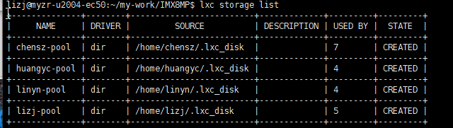
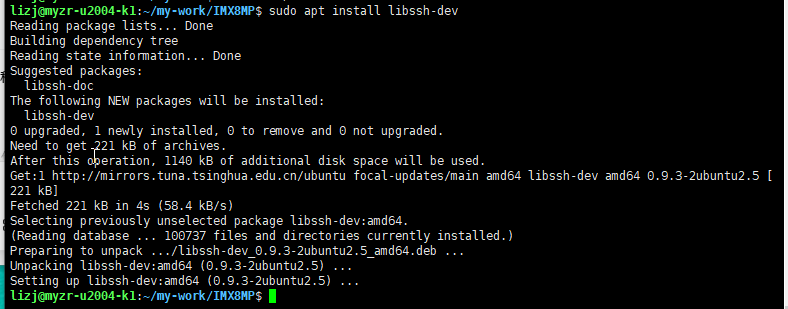

虚拟机账号：lizj

密码：92wVyzU6croD17if

未解决：


进入容器

```
lxc exec myzr-u2004-8MP --user 1007 --group 1007 --env HOME=/home/lizj --cwd /home/lizj -- /bin/bash


lxc exec myzr-u2004-3588 --user 1007 --group 1007 --env HOME=/home/lizj --cwd /home/lizj -- /bin/bash

lxc exec myzr-u2204-3576 --user 1007 --group 1007 --env HOME=/home/lizj --cwd /home/lizj -- /bin/bash

lxc exec myzr-u2204-t536 --user 1007 --group 1007 --env HOME=/home/lizj --cwd /home/lizj -- /bin/bash

```

退出当前容器

```
exit
```

列出所有容器

```
lxc list
#简洁文本列表
lxc ls
```


在容器外执行容器命令需要在命令前面加上lxc

容器内部则不需要

```
#查看全部LXD存储池底下的容器,包括已停止运行容器
lxc storage info lizj-pool
```

输出：



5 = 这个存储池里一共挂载了 5 个容器


新建容器

```
#进入一个容器，查看Ubuntu版本，用户名为root
lxc exec myzr-u2004-3588 -- /bin/bash
#用户名为l
lxc exec myzr-u2004-3588 --user 1007 --group 1007 --env HOME=/home/lizj --cwd /home/lizj -- /bin/bash

#进入8MP
lxc exec myzr-u2004-8MP --user 1007 --group 1007 --env HOME=/home/lizj --cwd /home/lizj -- /bin/bash

```


```
# 第一步：停止k1容器
lxc stop myzr-u2004-k1

# 第二步：重命名（把k1改成你想要的名字，示例改成ubuntu2204-k1）
lxc move myzr-u2004-k1 myzr-u2004-8MP

# 第三步：启动新名称容器
lxc start myzr-u2004-8MP

# 查看改名结果
lxc list
```


```
#查看所有能用Ubuntu版本
lxc image list images: ubuntu/

```


进入容器后

安装依赖包

```
sudo apt install libssh-dev
```

输出

```
lizj@myzr-u2004-k1:~/my-work/IMX8MP$ sudo apt install libssh-dev
Reading package lists... Done
Building dependency tree       
Reading state information... Done
Suggested packages:
  libssh-doc
The following NEW packages will be installed:
  libssh-dev
0 upgraded, 1 newly installed, 0 to remove and 0 not upgraded.
Need to get 221 kB of archives.
After this operation, 1140 kB of additional disk space will be used.
Get:1 http://mirrors.tuna.tsinghua.edu.cn/ubuntu focal-updates/main amd64 libssh-dev amd64 0.9.3-2ubuntu2.5 [221 kB]
Fetched 221 kB in 4s (58.4 kB/s)                                    
Selecting previously unselected package libssh-dev:amd64.
(Reading database ... 100737 files and directories currently installed.)
Preparing to unpack .../libssh-dev_0.9.3-2ubuntu2.5_amd64.deb ...
Unpacking libssh-dev:amd64 (0.9.3-2ubuntu2.5) ...
Setting up libssh-dev:amd64 (0.9.3-2ubuntu2.5) ...

```




