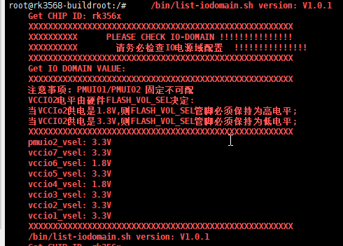

| 测试功能 | 结果 | 备注 |
| -------- | ---- | ---- |
| 以太网   |      |      |
| USB      | pass |      |
| RTC      |      |      |
| WiFi     |      |      |
| adb      | pass |      |

烧录




# 板卡基础功能测试手册

## 1. 测试目的

本文档用于指导测试人员通过 `adb` 连接板卡后，完成以下基础功能验证：

- 以太网测试
- USB1 / USB2 接口测试
- RTC 测试
- Wi-Fi 测试

测试人员可严格按照本文档步骤执行，并根据预期结果判断是否通过。

## 2. 测试准备

### 2.1 测试环境

- 测试板卡 1 台
- PC 1 台，已安装 `adb`
- 网线 1 根，并确保网络可正常分配 IP
- U 盘 1 个
- Wi-Fi 环境 1 套
- Wi-Fi 名称：`realme`
- Wi-Fi 密码：`123456789@zc`
- Wi-Fi 驱动文件：`8723du.ko`

### 2.2 连接确认

1. 将板卡通过 `adb` 连接到 PC。
2. 在 PC 端执行：

```bash
adb devices
```

3. 确认设备在线后进入板卡 shell：

```bash
adb shell
```

预期结果：

- `adb devices` 能看到目标设备
- 可以正常进入板卡命令行

## 3. 测试项目

---

## 3.1 以太网测试

### 3.1.1 测试步骤

1. 插好网线，确认对端网络可用。
2. 在板卡 shell 中执行：

```bash
ifconfig eth0 up
```

3. 获取 IP：

```bash
udhcpc -i eth0
```

4. 获取到 IP 后，执行连通性测试：

```bash
ping 8.8.8.8
```

建议观察 3 到 5 个回包后使用 `Ctrl + C` 结束。


### 3.1.2 通过标准

- `ifconfig eth0 up` 执行无明显报错
- `udhcpc -i eth0` 能成功获取 IP 地址
- `ping 8.8.8.8` 有稳定回包，无持续丢包

### 3.1.3 记录项

- 是否获取到 IP：____
- `ping 8.8.8.8` 是否正常：____
- 测试结论：通过 / 失败

---

## 3.2 USB1 / USB2 测试

说明：两个 USB 口分别单独测试，每次插入 U 盘后确认系统是否识别到 `/dev/sda1`。

### 3.2.1 USB1 测试步骤

1. 将 U 盘插入 USB1 接口。
2. 在板卡 shell 中执行：

```bash
ls /dev/sda1
```

### 3.2.2 USB1 通过标准

- 能识别到 `/dev/sda1`
- `ls /dev/sda1` 有返回，不提示文件不存在

### 3.2.3 USB2 测试步骤

1. 拔出 U 盘。
2. 将同一个 U 盘插入 USB2 接口。
3. 在板卡 shell 中再次执行：

```bash
ls /dev/sda1
```

### 3.2.4 USB2 通过标准

- 能识别到 `/dev/sda1`
- `ls /dev/sda1` 有返回，不提示文件不存在

### 3.2.5 记录项

- USB1 是否识别 `/dev/sda1`：____
- USB2 是否识别 `/dev/sda1`：____
- 测试结论：通过 / 失败

注意：

- 建议两个 USB 口分别独立插拔测试，不要同时插多个存储设备。
- 若设备节点名称变化，可先执行 `ls /dev/sd*` 辅助确认，但测试判定仍以是否成功识别 U 盘为主。

---

## 3.3 RTC 测试

### 3.3.1 测试步骤

1. 第一次读取 RTC 时间：

```bash
hwclock -r -f /dev/rtc0
```

2. 间隔约 10 秒。
3. 第二次读取 RTC 时间：

```bash
hwclock -r -f /dev/rtc0
```

### 3.3.2 通过标准

- 命令执行无明显报错
- 两次读取均能显示 RTC 时间
- 第二次读取的时间晚于第一次，说明时间在正常递增

### 3.3.3 记录项

- 第一次时间：____
- 第二次时间：____
- 时间是否正常增加：____
- 测试结论：通过 / 失败

---

## 3.4 Wi-Fi 测试

### 3.4.1 测试前说明

本测试使用以下 Wi-Fi 信息：

- SSID：`realme`
- 密码：`123456789@zc`
- 驱动文件：`8723du.ko`

若 `8723du.ko` 尚未放到板卡中，可先在 PC 端执行：

```bash
adb push 8723du.ko /tmp/
```

然后进入板卡 shell，在对应目录下执行后续命令。例如：

```bash
cd /tmp
```

### 3.4.2 测试步骤

1. 加载 Wi-Fi 驱动：

```bash
insmod 8723du.ko
```

2. 生成 `wpa_supplicant` 配置文件：

```bash
wpa_passphrase LZJ 888888 > /etc/wpa_supplicant.conf
```

3. 启动 Wi-Fi 连接：

```bash
wpa_supplicant -B -i wlan0 -c /etc/wpa_supplicant.conf
```

4. 申请 IP 地址：

```bash
udhcpc -i wlan0
```

### 3.4.3 通过标准

- `insmod 8723du.ko` 执行无明显报错
- `wpa_supplicant` 能正常启动
- `udhcpc -i wlan0` 能成功获取 IP 地址

### 3.4.4 记录项

- 驱动是否加载成功：____
- Wi-Fi 是否连接成功：____
- 是否获取到 IP：____
- 测试结论：通过 / 失败

注意：

- 若 `wlan0` 不存在，先确认驱动是否加载成功。
- 若 `udhcpc -i wlan0` 无法获取 IP，先检查热点名称和密码是否正确，以及热点是否开启 DHCP。


备注：

```
mv /bin/list-iodomain.sh /bin/list-iodomain.sh.bak
#恢复
mv /bin/list-iodomain.sh.bak /bin/list-iodomain.sh
```

