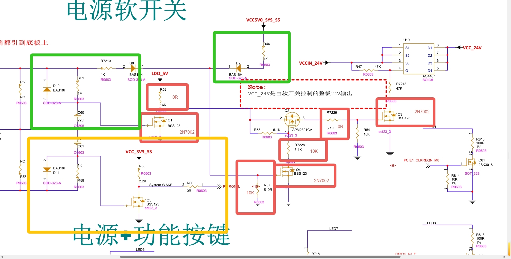

测试说明：

开发板未开机之前：U10电源线（1脚）500mV

三极管1脚5.2V左右

上电之后，电源24V，三极管1脚800mV(超过1V)自动关机


mos管1脚，


压力测试

wifi登陆：192.168.128.97

```
while true; do stress --cpu 4 --io 2 --vm 2 --vm-bytes 128M --timeout 60s; done
```

加了电阻之后，信号脚电压：Vp+=3.2V,Vp-=2.8V   

Q4为N沟道，栅极电压>源极电压，阈值电压1.7V，负压

源极接系统地，漏极接Q2的栅极，控制Q2的栅极点位，栅极接


Q2为P沟道：栅极电压<源极电压，阈值电压900mV

前置条件：短接Q4的2和3脚（强制上电），源极和栅极短接

时间：7/11 星期六

上午

## 测量1：

一个小时后

U10的1脚在0~24伏之间跳变，

Q2的2脚（源极）一直不变

下午

## 测量2：

测量时间55分钟

Q2的3脚（漏极 ），

## 测量3：

测量时间：48分钟   

Q3的1脚（栅极），U10的1脚（电源脚），

电源：23~23.4V，信号脚4.84 ~5.08

触发条件：19.2V，4.24V

- 把R52从5.1K换成1K，Q3的1脚稳定在3V左右， 52分钟掉电，电压变化剧烈

- R52换成0R，Q3的1脚稳定在5V~4.88V，55分钟掉电，24V波动不是很剧烈了，5V掉成2V

  13号下午：

- 拆掉电阻R51（1M欧姆），50分钟之后，电源Vpp在1.6~16V之间跳变，信号线800mV到2.4V之间跳变

- 再拆掉C60，


|                | 刚上电                           | 上电一个小时 | 备注                 |
| -------------- | -------------------------------- | ------------ | -------------------- |
| 拆掉C60        | VCCIN_24V=22.4到24，信号脚4到5.6 |              | 10分钟就不行了       |
| 拆掉Q1         | VCCIN_24V=22.4到24，信号脚4到5.6 | 4：07        | 一个小时40分钟不跳电 |
| 重新再焊新的Q1 |                                  | 5：54        | 5分钟后不稳定        |
|                |                                  |              |                      |


差分时钟对信号线

AG12/MIPI_DSI_TX_CLKP：Clock Positive，差分时钟正极
AF12/MIPI_DSI_TX_CLKN：`CLKN`：Clock Negative，差分时钟负极

从24到13引脚

13和14引脚是1.8V，其他引脚是悬空状态（无波形）


测量mos管好坏

黑色接栅极，红表笔接漏极

黑色接栅极，红色接源极

红黑再重新调换一下


黑接源极，红色接漏极


现在重新换料，怀疑是某个元器件规格不准确



Q4的2脚和3脚短接，绿框和黄框全部下料，红色框进行换料，其中Q1可以不换
