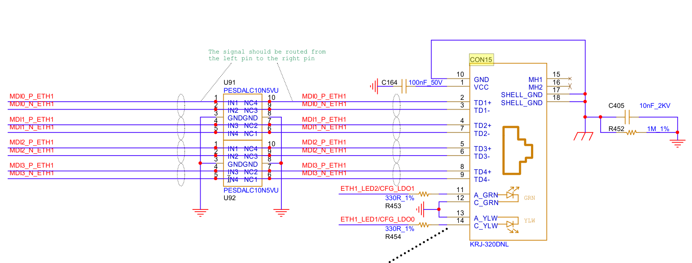
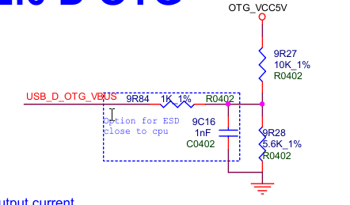

## PDM MEMS 数字硅麦

Pulse Density Modulation：脉冲密度调制

Micro-Electro-Mechanical System：微机电系统

## 网口接口

PHY 是一颗独立以太网收发芯片（YT8531/RTL8211 等），焊在 PCB 上。

板子必须给它提供稳定电压（3.3V/2.5V/1.0V 等），来自设备内部电源芯片

# 电感

 **绕线电感**（Wirewound Inductor）

通俗理解：在磁芯（铁氧体 / 铁粉芯）上用漆包线一圈圈绕出来的电感，就像把铜线绕在磁棒上。

核心特点

电感量大、直流电阻（DCR）低、电流承载能力强，能承受较大的纹波电流。

成本低、工艺成熟，但体积偏大，高频性能一般。

典型应用：电源 DC-DC Buck/Boost 电路、大电流滤波（如主板供电、电机驱动）、电源输入滤波。

代表类型

贴片绕线电感（SMD Power Inductor）：主板、显卡供电用的方型 / 圆柱电感。

插件工字电感：DIY 电源、适配器里的圆柱形电感。

 **叠层电感**（Multilayer Chip Inductor, MLCI）

通俗理解：像叠积木一样，把印刷了线圈的陶瓷 / 铁氧体层叠压在一起，一体烧结而成的贴片电感。

核心特点

超小体积（常见 0201/0402/0603 封装）、无引线、一致性好，适合 SMT 自动化生产。

高频性能好（MHz 级），但电感量小、电流承受能力弱，直流电阻偏大。

典型应用：射频电路、高速信号线滤波（如你图里的小信号滤波）、手机 / 穿戴设备的电源滤波。

**共模扼流圈**（Common Mode Choke, CMC）

通俗理解：把两组线圈对称绕在同一个磁芯上的特殊电感，专门处理「差分信号」。

核心特点

对差分信号几乎无影响，对两条线上的同方向干扰（共模噪声）有极强的抑制作用。

常见 4 引脚封装，有贴片和插件两种形式。

典型应用：USB、HDMI、PCIe、SATA 等高速差分接口，电源输入 EMI 滤波（如电脑电源、适配器）。

**磁珠**（Ferrite Bead）

通俗理解：本质是一种高频损耗型电感，把导线穿过铁氧体磁珠，对高频信号的阻抗极大，低频几乎无阻碍。

- 核心特点

  高频（>100MHz）抑制效果极强，主要用来滤除高频 EMI 噪声，而不是储能。

  通常用「某频率下的阻抗值」标注（如 0603 600Ω@100MHz），单位是 Ω，不是 μH。

  典型应用**：高速信号线、时钟线、电源轨的高频噪声抑制，比如主板上的时钟线、USB 数据线。

**功率电感**（Power Inductor，含屏蔽 / 半屏蔽 / 非屏蔽）

通俗理解：专门为电源电路设计的大电流电感，按磁芯屏蔽结构分为三类。

非屏蔽功率电感：成本低，但漏磁大，易干扰周围电路。

半屏蔽功率电感：侧面加了金属屏蔽，漏磁比非屏蔽小，成本适中。

全屏蔽功率电感：磁芯完全包裹线圈，漏磁极小，EMI 性能好，适合高密度 PCB。

核心特点：大电流、低 DCR、低损耗，电感量从 nH 到几十 μH 不等。

典型应用：手机 / 电脑主板供电、服务器电源、工业控制电源。

**环形电感**（Toroidal Inductor）

通俗理解：线圈绕在环形磁芯上的电感，磁路闭合，漏磁极小。

核心特点：EMI 性能好、效率高，可做共模扼流圈也可做单电感，插件形式居多。

**典型应用**：电源输入 EMI 滤波、开关电源输出滤波、音频功放电路。

DLM11SN900HY2L 是日本村田（Murata）生产的一款超小型贴片共模扼流圈（Common Mode Choke / 共模滤波器），用于高速差分信号线的共模噪声抑制。属于电感

# 电容

------

**10015vRVT → 100μF / 15V，RVT 系列贴片铝电解电容**

拆解：

- **100**：容量 = 100μF
- **15V**：耐压 = 15V
- **RVT**：系列代号（贴片铝电解，宽温 -55℃～+105℃）

| 容值  | 封装                 | 材质 / 类型       |           耐压           |
| ----- | -------------------- | ----------------- | :----------------------: |
| 100µF | E_C6（电解电容封装） | **SVPF 电解电容** |           25V            |
| 22µF  | C0805                | X5R 陶瓷电容      | （通常≥10V，这里标 25V） |
| 0.1µF | C0402                | X5R 陶瓷电容      | （通常≥10V，这里标 25V） |

## **SVPF电解电容**

- 给负载突变提供**瞬时电流**（比如负载突然增大时，由 C207 放电补充电流）。
- 滤除电源中**几十 Hz 到几 kHz 的低频纹波**（比如前级开关电源的工频纹波）。

- 它是整个电源的 “大水塘”，负责稳住整体电压，防止电源在负载波动时掉电。
- **有极性的铝电解电容**，SVPF 代表低阻抗、高纹波电流的型号。

## **MLCC陶瓷电容**

- 多层陶瓷电容，无极性，ESR 极低。
- 特点：响应速度快，适合滤除高频噪声和尖峰。

**22µF 陶瓷：中高频纹波抑制**

- 滤除**几 kHz 到几 MHz 的中高频纹波**。
- 配合电解电容，弥补电解在中高频下滤波效果变差的问题。

**0.1µF 陶瓷：高频尖峰 / 噪声滤除**

- 滤除**几 MHz 到几十 MHz 的高频尖峰和开关噪声**。

- 典型的去耦电容，就近安装在电源引脚旁，抑制电源线上的高频干扰。

  

## 储能、去耦、滤波电容

大电容：CPU电源，低频滤波/储能。47uF 介质为X5R（温度稳定性好→温度系数：温度变化，容值不发生改变）

中容量电容：0.1uF  X5R，主去耦电容

小容量电容：高频尖峰抑制 ，介质C0G，温度系数几乎为0，33pF,10pF

只放一个 22µF，或者只放一个 0.1µF，会导致某一段频率的纹波滤不掉。

小电容（0.1µF 等）必须**尽量靠近芯片电源引脚**，越近越好，走线越短越好。

大电容可以稍远一点，但也要靠近模块 / 芯片的供电入口。

放对位置，比纠结 “0.1 还是 0.047µF” 更关键。

按键硬件消抖动，并列一个10uF电容

# RC、LC

- **RC 电路截止频率公式**:Fc = 1/(2πR C）

- 低于Fc的频率通过，高于Fc的频率衰减
- 大容值电容对低频信号容抗很低，有效滤除工频纹波和开关电源的低频纹波

# **RC串联**

**核心原理：**

- 电容的阻抗随频率变化：X~c~=1/(2πfC)

电阻上的电压与电流相同

**RC并联**：两端电压一致，多用于电荷泄放、高频滤波，电流相位超前电压。

**LC串联**：谐振时阻抗最小、电流最大，常用作选频、陷波与升压电路。

**LC并联**：谐振时阻抗最大、总电流最小，多用于振荡、选频与阻抗变换。

# 

# NC/0R

**NC** :不焊接相当于断路

- 预留位：板子上先留好焊盘，现在不用，以后改版可以直接焊元件，不用重新画板。
- 版本兼容：同一 PCB 要做好几个版本，有的版本要这个元件，有的不要，不要的就标 NC，生产时不贴。
- 功能选择：比如上拉 / 下拉二选一，一边焊电阻，另一边 NC。
- 调试断开：现在不需要这路信号 / 电源，NC 直接断开，避免干扰。

**0R**：焊接0R电阻相当于导线

- 当跳线用：PCB 走线交叉走不过去，用一颗 0R 跨接，省打过孔。
- 通断可控：焊上就是接通，拆掉就是断开，方便调试、换配置。
- 电流测试点：串在电源 / 信号线上，拆下 0R，串电流表测电流，测完再焊回去。
- 单点接地（EMC）：数字地、模拟地分开铺铜，中间用一颗 0R 连接，抑制地噪声。

NFC 天线的谐振频率和匹配阻抗，是由天线线圈的电感、走线寄生电容、以及外部匹配网络共同决定的。

- 这两个小电容（1~1.2pF）是**微调电容**，用来给天线做谐振频率和阻抗的微调
- 标`NC`就是先不焊，让电路工作在 “原始状态”，方便测试天线的基础谐振点，再根据测试结果决定要不要加、加多大的电容

2. 直接焊上反而可能破坏 NFC 的谐振

- NFC 的工作频率是**13.56MHz**，天线需要精准谐振在这个频率上才能获得最好的读卡距离
- 焊上 C31/C32 后，会给信号路径额外增加对地电容，可能会把谐振频率拉低，导致天线失谐，读卡性能下降
- 1~1.2pF 的电容对射频信号的影响很大，尤其是在高频下，哪怕是几 pF 的变化，都会明显改变天线的匹配状态

3. 电路本身的寄生电容已经够了

PCB 走线、天线座子、线圈本身都会自带几 pF 的寄生电容，对于很多标准 NFC 天线来说，这些寄生电容已经足够让天线谐振在 13.56MHz 了，额外再加电容反而会过补偿，得不偿失。

什么时候才需要焊上电容？

只有在**调试发现天线谐振频率偏高**（比如跑到 15MHz 以上），或者阻抗不匹配时，才会考虑在这两个位置焊上小电容，用来拉低谐振频率、优化匹配。

所以标 NC 的核心原因是：**它们是预留的调试元件，不是电路必须的，默认不焊，避免破坏原始匹配状态。**

# 分压检测电路

检测端（USB_D_OTG_VBUS）：忽略CPU支路，近似于开路

1k电阻和1nF电容组成RC滤波，滤除高频干扰，防止CPU误判VBUS状态

5个引脚

这个 J3 连接器同时集成了 **UART 调试串口**（TX/RX）和 **USB 下载接口**（DP/DM + 电源），是一个复合的调试 / 下载口。

- **引脚 1：PM_UART1_RX**是 UART（Universal Asynchronous Receiver/Transmitter，通用异步收发传输器）的**接收端（Receive）**，对应你说的 `RX`，用于接收串口数据。

- **引脚 2：PM_UART1_TX**是 UART 的**发送端（Transmit）**，对应你说的 `TX`，用于发送串口数据。

- **引脚 4/5：DP/DM（USB ==差分信号==）**固件下载是 USB OTG（On-The-Go）的数据线，用于 USB 协议的下载 / 通信，和 UART 的 TX/RX 是两套独立的通信接口，互不干扰。

# 防浪涌二极管

ESD 管就是电路里的 “静电避雷针”，专门吸收接口上的静电尖峰，保护芯片不被打坏，同时不影响正常信号传输。

正常工作时：ESD 管处于反向截止状态，几乎不导通，寄生电容极低，对电路信号几乎没有影响。
静电 / 浪涌来临时：当电压超过 ESD 管的触发电压，它会在纳秒级内快速导通，把尖峰电流泄放到地，同时把电压钳位在安全范围，避免后端芯片被高压击穿。
尖峰消失后：ESD 管自动恢复截止状态，不影响电路正常工作。

| 参数                  | 含义                                 | 设计要点                                                     |
| --------------------- | ------------------------------------ | ------------------------------------------------------------ |
| **反向工作电压 VRWM** | 器件正常工作时能承受的最大反向电压   | 必须大于电路的正常工作电压，比如 USB 5V 信号，选 5V/6V 档    |
| **钳位电压 Vc**       | ESD 导通后，把尖峰电压限制到的最大值 | 越低越好，Vc 必须低于后端芯片的耐压值                        |
| **寄生电容 Cj**       | 器件的等效电容                       | 高速信号（USB2.0/3.0、HDMI）必须选低电容型号（≤1pF），否则会导致信号衰减、丢包 |
| **ESD 防护等级**      | 能承受的最大静电冲击                 | 常见 ±8kV/±15kV/±25kV（接触放电），等级越高防护越强          |
| **封装**              | 器件的物理封装                       | 常用 0402/0201、DFN1006、SOT-23、SOT-143、DFN2510 等，       |

| 类型            | 特点                      | 典型型号               | 适用场景                          |
| --------------- | ------------------------- | ---------------------- | --------------------------------- |
| 单通道 ESD 管   | 一颗保护 1 路信号，体积小 | AZ5413-01F、TPD1E1B06  | USB2.0 D+/D-、UART、GPIO 单路信号 |
| 多通道 ESD 阵列 | 一颗集成 2/4 路，节省空间 | AZ1143-04F、IP4292CZ10 | USB3.0、HDMI、SATA 等多对差分信号 |

| 类型       | 典型电容 | 适用场景                           |
| ---------- | -------- | ---------------------------------- |
| 低电容 ESD | ≤1pF     | 高速信号（USB2.0/3.0、LVDS、MIPI） |
| 通用 ESD   | 1~10pF   | 低速信号（电源、按键、普通 IO）    |

**注意事项**：

不能混用场景：==高电容== ESD 管不能用在 USB2.0/3.0 等高速信号上，否则会导致设备识别失败、传输不稳定。
必须就近接地：ESD 管的接地引脚要直接、短粗地连接到地平面，走线越长，泄放效率越低，防护效果越差。
不能省略 ESD 管：USB、HDMI、网口等接口，必须加 ESD 管，否则用户插拔、运输过程中的静电很容易打坏主控芯片，导致批量返修。
替换要注意兼容：同封装的 ESD 管，也要确认反向电压、钳位电压和寄生电容是否匹配，不能只看封装直接替换。

ESD 管：侧重==纳秒级==的静电尖峰防护，寄生电容极==低==适合信号线。
TVS 管：侧重 ==微秒级==的浪涌防护，功率更大，适合电源线路。
你电路里用的 AZ5413-01F、AZ1143-04F，本质都是低电容 TVS，专门优化了 ESD 防护性能，也常被直接称为 ESD 管。

ESD管是TVS管的子集

ESD 管：本质就是低电容、小功率、快响应的 TVS，专门针对 “静电” 这种电压高、能量小、时间极短的尖峰。

ESD5451N

# 线性稳压器

LP5907MFX-3.3/NOPB  

**低噪声、低压差线性稳压器（LDO）**，核心作用是把不稳定的输入电压转换成稳定的 3.3V 输出，同时抑制电源噪声，给对纹波敏感的芯片（如 MCU、传感器）供电。

Low Dropout(压差) Linear Regulator(稳压器)

| 型号部分 | 含义                               |
| -------- | ---------------------------------- |
| LP5907   | 系列型号，代表低噪声、低 IQ 的 LDO |
| MFX      | 封装标识：SOT-23-5 贴片封装        |
| 3.3      | 固定输出电压：3.3V                 |
| NOPB     | 无铅、无卤，符合 RoHS 标准         |

NJU9103

**接口**：**SPI**（最高 10MHz）

**ADC**：16 位无失码 ΔΣ 型

# 外观芯片规格解读

**FORESEE 1P077**：

这是一颗 **LPDDR4X 内存颗粒**（也就是系统运行内存，相当于电脑的 “内存条”）。==RAM==内存

结合 i.MX8MP 平台的常见配置，容量通常为 **2GB 或 4GB**，是核心板的主运行内存。

**FORESEE FDND825**：

这是一颗 **eMMC 闪存芯片**（相当于电脑的 “硬盘 / SSD”）。==ROM==存储

容量通常为 **8GB/16GB/32GB**，用来存放系统镜像、应用程序和用户数据。

**SPI NAND** :

非易失性存储芯片，NAND Flash。用SPI协议通信的NAND Flash芯片，把复杂的NAND存储，用SPI接口挂到主控上

# 4种IO输出

1. 推挽输出（Push-Pull Output）
2. 开漏输出（Open-Drain Output，OD）
3. 开集输出（Open-Collector Output，OC）
4. 高阻输入 / 浮空模式（High-Z / Floating）

衍生 / 常用配置模式

上拉输入（Pull-Up Input）

下拉输入（Pull-Down Input）

复用推挽输出（Alternate Function Push-Pull）

复用开漏输出（Alternate Function Open-Drain）

模拟输入（Analog Input）

每种模式通俗特点

推挽：高低电平都能主动驱动，灌电流拉电流都强，直连负载、做普通 IO。

开漏：只能拉低电平，==高电平靠外部上拉电阻==，支持线与、I2C、单总线。

开集：三极管版本的开漏，多用于老款逻辑电路、高压隔离驱动。

高阻浮空：既不输出也不拉高低，相当于断开，做纯输入。

上拉 / 下拉输入：内部自带电阻固定默认电平，防干扰漂移。

复用推挽 / 开漏：IO 复用为外设功能（串口、SPI、I2C），不是普通 GPIO。

模拟输入：关闭数字驱动，给 ADC 采集电压用。

# 示波器

带宽限制20MHz

适用于测量电源纹波，普通直流信号，用20MHz可以减少噪声，

测量时钟，PWM或者高速数字信号，切回全带宽（无限制，可至200MHz），避免信号被误处理

耦合设置，

交流耦合  

## 电源纹波

叠加在直流稳定量上的交流分量为纹波，

电源纹波影响设备性能和稳定性，

昂贵的线性直流电源纹波小，经济实惠的开关电源纹波大

危害：

产生谐波，降低电源效率

高频电源纹波会产生浪涌电压或电流，加速设备老化

干扰电路的逻辑关系，带来噪声干扰，影响信号的测量

纹波和噪声幅度一般比较小

设置带宽20MHz，避免数字电路的高频噪声影响纹波测量

使用接地环，避免长鳄鱼夹的地线引入无关的噪声

通道耦合选择交流耦合，减少高频噪声

电压档位10mV

探头×1档位，因为电源纹波幅值一般较小

×10信号会衰减10倍进入仪器，再通过数字放大10倍，这个过程会放大很多噪声，导致纹波测量值偏高

关注两个参数

峰峰值（**Vpp**）和均方根（**RMS**）值

噪声产生途径
1.外界电磁场干扰（EMI）

2.电源自身产生

## 测量三大类：

电压大小，时间频率，波形好坏与时序关系

电压：

峰峰值电压：波形最高点到最低点的电压差

最大值/最小值：波形最高、最低瞬时电压

有效值：交流信号等效直流电压

平均值：波形直流分量、静态偏置电压

高电平/低电平：数字信号逻辑1，逻辑0电压

**过冲 / 下冲**：信号跳变时超出正常电平的尖峰

时间 & 频率相关

1. **周期**：一个完整波形的时间
2. **频率**：单位时间波形个数（频率 = 1 / 周期）
3. **上升时间**：信号从 10% 升到 90% 电平的时间
4. **下降时间**：信号从 90% 降到 10% 电平的时间
5. **脉冲宽度**：高电平或低电平持续时间
6. **占空比**：高电平时间 ÷ 整个周期
7. **相位差**：两个同频率信号之间的时间相位偏移

三、信号质量类

- **纹波**：电源直流上的小幅波动
- **噪声**：波形上杂乱细小毛刺
- **畸变 / 失真**：正弦波变畸形、方波变圆角
- **振铃**：跳变后上下震荡衰减的波形

四、时序 & 总线类

- 多路信号**时序延时**、先后顺序
- SPI/I2C/UART/CAN 等**总线时序、高低电平、波特率**
- 上电 / 复位**时序曲线**

# 常见焊接方式

- 回流焊 = 所有贴片器件（SMD）

  0201/0402 电阻电容、IPEX 天线座、蓝牙 / WiFi 芯片、ES8388 音频 IC、DDR、主控 T536 这类 BGA 芯片，全部贴在 PCB 表面，走回流炉一次性焊完。

- 波峰焊 = 穿孔插件器件（THT）

  DC 电源座、DB9 串口、排线端子、大电解电容、带针插接头，元件引脚穿过 PCB 孔，板子过熔融锡波完成焊接。

# expert电子

电源部分PCB

6PIN Type-C接口(仅供电)

CC1 CC2快充

0805贴片电阻

开关ss3235S

两侧6个触点

AMS1117,3.3V

10uF ，0.1uF

LQFP44封装

5V供电

PNP 发射极（e）基极（b）集电极（c）

镍氢

