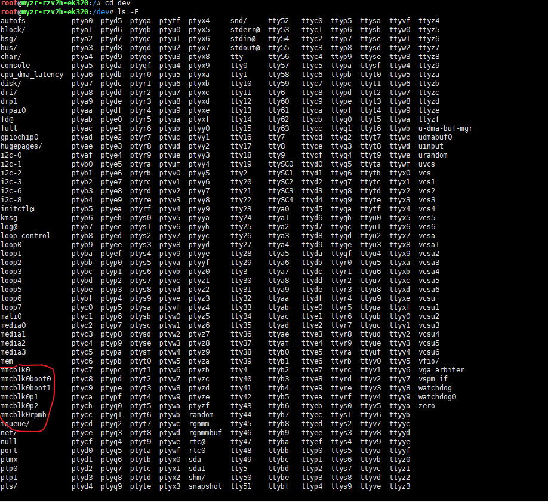

| 修改需求                  | 需要重编哪一个      |
| ------------------------- | ------------------- |
| 换底板、改屏幕 / 按键引脚 | U-Boot + Linux 内核 |
| 加 NFS 挂载工具、新增命令 | Buildroot           |
| 只开启内核 NFS 协议驱动   | Linux 内核          |
| 修改开机自动启动脚本      | Buildroot           |
| 调整 DDR 内存硬件时序     | U-Boot              |

1. U-Boot=电脑主板BIOS

​	板子通电后最先跑的程序，先把内存、显示屏、网口这些硬件唤醒初始化，再找到系统初始化

​	在更换底板，改内存布线，改启动方式时需要重新编译

2. Linux内核=windows系统底层核心

​	所有的硬件，包括屏幕、网口、按键、USB、芯片引脚都要靠设备树DTS记录底板引脚定义

​	在换引脚、改屏幕/案件引脚、开启内核nfs网络协议，就要重新编译内核

3. buildroot根文件系统=Windows里的软件、工具、桌面

   内核启动必须加载这个，里面包括命令，图形桌面，各类工具。

   在缺工具，加软件，改开机脚本，只需要重新编译Buildroot

SPL

Secondary Program Loader，中文：二级程序加载器

信号眼宽度在0x30~0x40之间，窗口充足，内存稳定

采样相位最小/中间/最大值，区间跨度均匀=布线匹配

verf电压：LPDDR一般25%~32%，超出区间会信号失真

结尾out=DDR全部训练完成，无内存故障

## 查看内核版本

```
#输入
uname -a
#输出
Linux myzr-rk3588-buildroot 5.10.226 #4 SMP Wed Jun 17 03:02:26 UTC 2026 aarch64 GNU/Linux
```

或者

```
#查看Buildroot文件系统版本
cat /etc/buildroot-version
```

## 清理内存

```
# 清理全部缓存安装包
sudo apt clean
# 清理不再使用的旧版本缓存包（保留当前在用版本）
sudo apt autoclean
```


## Busybox

Busybox内置精简版ln

```
# 格式：ln -s 源文件/目录 软链接名称
ln -s /etc/pulse/ pulse-link
```

## 文件系统

1.

- ext4:

Linux原生系统

存放 Linux 系统、Buildroot 根文件、程序、日志、录音；

支持权限、软链接、断电日志保护，是系统运行必需；

- FAT32：


微软标准，Windows、Linux、相机、车载全设备通用

只做跨设备交换介质：把板子文件拷到 Windows，或者电脑拷固件到开发板；

查看文件系统类型：

```
#只看跟目录
df -Th /
#输出
Filesystem     Type  Size  Used Avail Use% Mounted on
/dev/root      ext4   14G  729M   13G   6% /
```

开发板上电后，系统真正挂载为 `/` 根目录的分区格式，是设备实际运行使用的 rootfs。


**2.**	查看当前内核编译支持的全部文件系统：

```
cat /proc/filesystems
```

- Buildroot 全称 Buildroot Build System，是根文件系统编译构建工具，用来打包生成 rootfs 镜像，不是文件系统格式；
- ext4/ubifs/squashfs/f2fs 这些才是**文件系统类**型，是分区的存储格式。

## 查看DTS


```python
#查找指令
find . -name "*.dts"
#T536设备数位置
/home/lizj/my-work/T536/t536-linux-5.10.198/device/config/chips/t536/configs/myzr_t536_ek270_amp/linux-5.10-rt/board.dts
#csz
/home/lizj/my-work/T536/chensz_t536/device/config/chips/t536/configs/myzr_t536_ek270/linux-5.10-origin/board.dts
```

## 二进制可执行文件（out）

.out 是交叉编译生成的嵌入式二进制可执行程序，不是文本文件

反汇编查看汇编指令

```
# 全志T536是ARM64，用aarch64-linux-gnu-objdump
aarch64-linux-gnu-objdump -d ./test_app/gpio_test.out
```


## 编译

rootfs 是应用、命令、工具集合，设备树是硬件描述，二者隔离。

只有改了 U-Boot 本身的设备树、板级配置、分区表、启动脚本时，才编译 U-Boot；单纯改外设供电 / 引脚 / 寄存器的 dts，完全不用。

单独编译uboot

```Bash
./build.sh uboot
```

单独编译**Kernel**

```Bash
./build.sh kernel
```

单独编译rootfs

在SDK主目录下输入如下命令:

**buildroot**

```Bash
./build.sh buildroot
```

**debian12**

```Plain
./build.sh debian
```

打包固件

```Bash
./build.sh firmware
```

打包update.img

```Bash
./build.sh updateim
```

## SD接口测试

```
root@myzr-rk3588-buildroot:/# [   71.549736] dwmmc_rockchip fe2c0000.mmc: could not set regulator OCR (-22)
[   71.549905] dwmmc_rockchip fe2c0000.mmc: failed to enable vmmc regulator
[   71.634320] mmc_host mmc1: Bus speed (slot 0) = 148500000Hz (slot req 150000000Hz, actual 148500000HZ div = 0)
[   71.845874] dwmmc_rockchip fe2c0000.mmc: Successfully tuned phase to 255
[   71.845985] mmc1: new ultra high speed SDR104 SDXC card at address 0001
[   71.847978] mmcblk1: mmc1:0001 SD 50.0 GiB 
[   71.850421]  mmcblk1: p1
```

（-22）：Linux 标准错误码，参数配置无效/错误

`vmmc`：MMC/SD 卡供电稳压电源（regulator），系统尝试配置卡供电失败供电调节器报错，但SD 卡最终依然识别、枚举成功（`mmcblk1`、分区 `p1` 正常出现），属于供电配置告警，非致命故障。

调试：

内部  设备树 (DTS) 配置问题
- `fe2c0000.mmc` 对应的 SD 控制器，`vmmc-supply` / `vqmmc-supply` 稳压电源节点引用错误、电压档位不匹配
- OCR 寄存器是 SD 卡电压识别寄存器，驱动设置供电电压时和硬件 / DTS 定义冲突，返回参数非法

```
#查看设备数加载状态
cat /proc/device-tree/fe2c0000.mmc/vmmc-supply
cat /proc/device-tree/fe2c0000.mmc/vqmmc-supply
```

**vmmc**：卡本体供电（动力电）

**vqmmc**：通信引脚 IO 供电（信号电）
设备节点相关：

```
root@myzr-rk3588-buildroot:/# ls /proc/device-tree/*mmc*
/proc/device-tree/mmc@fe2c0000:
bus-width	   compatible	  name	     pinctrl-names  vmmc-supply
cap-mmc-highspeed  disable-wp	  no-mmc     power-domains
cap-sd-highspeed   fifo-depth	  no-sdio    reg
clock-names	   interrupts	  phandle    sd-uhs-sdr104
clocks		   max-frequency  pinctrl-0  status
```

`sd-uhs-sdr104`、`cap-sd-highspeed`：开启了高速 SDR104 模式

```
#查看当前供电指向
cat /proc/device-tree/mmc@fe2c0000/vmmc-supply
#输出
%
```

- 没有vmmc-supply，开启了 `sd-uhs-sdr104` 高速模式，驱动会强制尝试 1.8V IO 切换
- 无 IO 供电节点 → 配置调节器失败 `-22` → SD 卡初始化超时 `-110`


开发板存储




```
/dev/mmcblk0
```

完整 eMMC 整块设备，代表整个内置闪存芯片，等价于电脑的整块硬盘 `/dev/sda`。

```
/dev/mmcblk0boot0` / `/dev/mmcblk0boot1
```

eMMC 专属**Boot 引导分区**，专门存放 uboot、启动固件，用于设备上电启动、恢复模式，容量很小（通常几 MB）。

```
/dev/mmcblk0p1` / `mmcblk0p2
```

eMMC 用户数据区的普通分区（p=partition 分区），就是系统、APP、文件存放的地方，对应硬盘的 `sda1、sda2`。

```
/dev/mmcblk0rpmb
```

RPMB 全称 **Replay Protected Memory Block（防重放安全存储块）**，eMMC 硬件安全分区，专门存密钥、指纹、支付证书等敏感加密数据，带硬件签名防篡改，普通程序不能随意读写。


开发板USB只能是HOST才能识别成sda

```
mount /dev/sda1 /mnt/nvme
```

